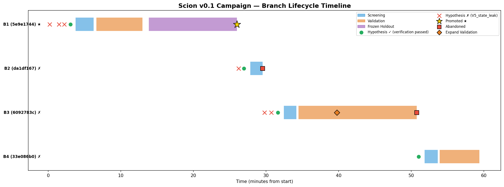
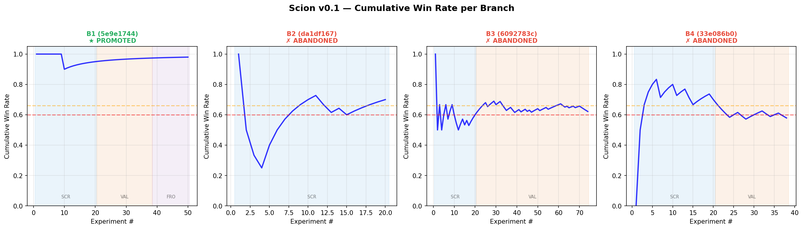
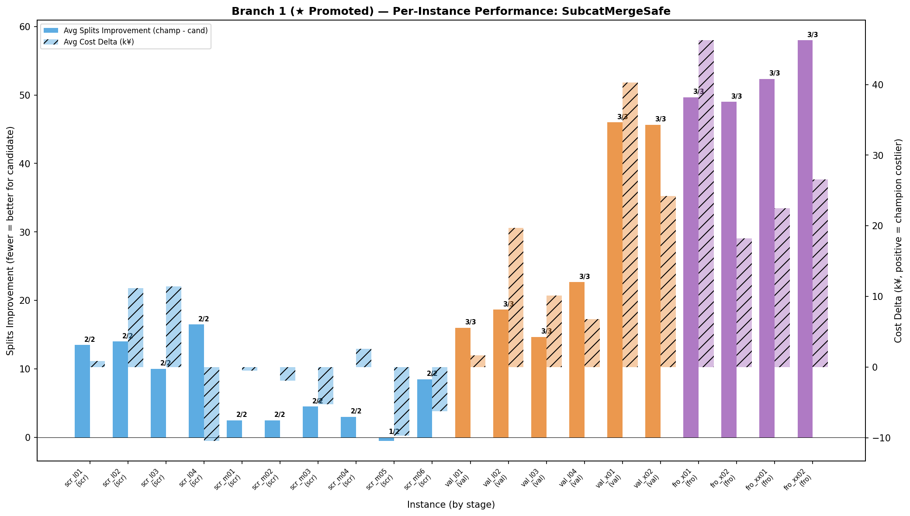
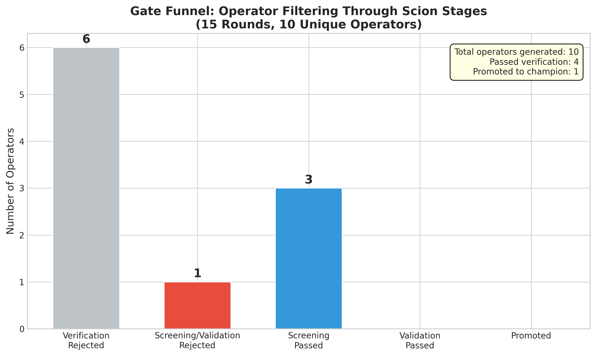

# Scion — LLM-Driven Algorithm Auto-Improvement for Combinatorial Optimization

[](https://www.python.org/downloads/)
[](#)
[](https://opensource.org/licenses/MIT)

**Scion**（嫁接/分支）是一个研究项目，探索如何利用 LLM 的推理能力自动改进组合优化算法中的启发式算子。与传统的 LLM+进化算法方法不同，Scion 将 LLM 视为**推理主体**（而非随机变异算子），通过假设驱动的搜索、三级统计验证和契约式治理，在保证安全性的前提下实现算子自动发现。

## 项目结构

```
.
├── design/              # 架构设计文档（从理论到工程的完整推演）
├── surrogate/           # Surrogate Solver — 仓配协同 VNS 求解器
├── scion/               # Scion Framework — 核心自动改进框架
├── reviews/             # GPT-5.4-Pro 架构审核报告
└── legacy/              # 早期设计草案与实验记录
```

---

## 📐 Design — 架构设计

`design/` 包含 Scion 从理论到工程的完整设计推演，共四份核心文档：

| 文档 | 内容 |
|------|------|
| [`scion-architecture-v3.md`](design/scion-architecture-v3.md) | **基石架构**：三层控制模型、22 条关键决策、Decision Input Guard 等核心设计 |
| [`scion-engineering-arch-v1.md`](design/scion-engineering-arch-v1.md) | **工程架构**：13 个模块、14 步主循环、23 个开发 Task 的完整拆分 |
| [`scion-v0.1-design.md`](design/scion-v0.1-design.md) | **MVP 设计**：v0.1 开发规格，模块接口、数据流、测试策略 |
| [`surrogate-problem-spec-v1.md`](design/surrogate-problem-spec-v1.md) | **目标问题定义**：仓配协同 VNS 的 ProblemSpec、算子接口、评价体系 |

### 核心架构概览

```
┌─────────────────────────────────────────────────────────────┐
│                    Campaign Manager                         │
│  (Branch lifecycle, round scheduling, budget control)       │
├─────────────────────────────────────────────────────────────┤
│  Creative Layer    Contract Gate    Verification Gate       │
│  (LLM, tainted) ──> (C1-C10,     ──> (V5 state leak, ──>  │
│                      static)          dynamic)              │
│                                                             │
│  Experiment Protocol (Screening → Validation → Frozen)      │
│  Decision Layer (Oracle, numerical features only)           │
├─────────────────────────────────────────────────────────────┤
│  Lineage (SQLite) │ Runtime (subprocess) │ Config (Pydantic)│
└─────────────────────────────────────────────────────────────┘
```

**关键设计原则**：

- **三层控制**：Creative（LLM, tainted）→ Gate Layer（静态+动态校验）→ Decision Layer（纯数值 Oracle）
- **Decision Input Guard**：决策层仅接收 `DecisionFeatures`（数值+枚举），彻底隔离 LLM 文本干扰
- **两轮 Proposal**：Round 1 Hypothesis（假设推理）→ Round 2 Code（代码生成）
- **三级实验协议**：Screening → Validation → Frozen Holdout，控制过拟合风险
- **字典序多目标**：业务聚合（subcategory splits）> 物流成本 > 求解效率

---

## 🚚 Surrogate Solver — 仓配协同 VNS

`surrogate/` 是 Scion v0.1 的**目标问题**实现：一个仓配协同场景下的 Variable Neighborhood Search (VNS) + Solution Pool 求解器。

### 问题描述

给定一批订单（每个订单包含多个 SKU，属于不同子品类），需要：
1. 将订单分配到车辆
2. 优化车辆路径
3. **核心目标**：最小化子品类拆分（subcategory splits）—— 同一子品类的订单尽量装同一辆车

### 求解器结构

```
surrogate/
├── models.py            # 数据模型：Order, Vehicle, Solution
├── solver.py            # VNS 主循环 + Solution Pool
├── vns.py               # VNS 框架：扰动-局部搜索-接受
├── greedy_init.py       # 贪心初始解构造
├── oracle.py            # 目标函数：字典序评价
├── pool.py              # Solution Pool 管理
├── config.py            # 求解器参数配置
├── data_generator.py    # Benchmark 实例生成器
├── registry.yaml        # 算子注册表（Scion 运行时读取）
├── operators/           # 算子库
│   ├── base.py          # Operator 基类（execute(solution, rng) → Solution）
│   ├── move_order.py    # 订单级：移动订单到另一辆车
│   ├── swap_orders.py   # 订单级：交换两辆车的订单
│   ├── destroy_rebuild.py   # 订单级：销毁重建
│   ├── merge_vehicles.py    # 车辆级：合并车辆
│   ├── split_vehicle.py     # 车辆级：拆分超载车辆
│   └── change_vehicle_type.py # 车辆级：变更车型
├── data/                # Benchmark 实例数据（22 个，54-675 orders）
└── tests/               # 求解器单元测试
```

### 算子接口标准

所有算子共享统一接口，这是 Scion 能够自动发现新算子的基础：

```python
class Operator(ABC):
    def execute(self, solution: Solution, rng: np.random.Generator) -> Solution:
        """接收一个解，返回一个新解。不得修改输入解。"""
        ...
```

---

## ⚙️ Scion Framework — 核心框架

`scion/` 是自动改进框架的完整实现。详细文档见 [`scion/README.md`](scion/README.md)。

### 技术规模

- **59 个 Python 文件**，9,272 行代码
- **239/239 tests** 全部通过
- **13 个模块**：core / config / contract / verification / protocol / proposal / runtime / failure / lineage / cli / problems

### 模块概览

| 模块 | 职责 |
|------|------|
| `core/` | Campaign 主循环、Branch 状态机、Decision Engine、Scheduler、Termination |
| `config/` | ProblemSpec、ProtocolConfig、SplitManifest、SeedLedger（Pydantic v2） |
| `contract/` | ContractGate — C1-C10 静态检查（语法、接口、禁用 import 等） |
| `verification/` | VerificationGate — V5 state leak 等动态校验 |
| `protocol/` | ExperimentProtocol — 三级实验、Bootstrap CI、字典序评价 |
| `proposal/` | LLMClient、CreativeLayer、ContextManager（暴露控制 + prompt caching） |
| `runtime/` | SubprocessRunner（隔离执行）、WorkspaceMaterializer、PoolManager |
| `failure/` | FailureRouter — 四层故障分类（syntax / contract / verification / statistical） |
| `lineage/` | SQLite Registry、BranchStore、ChampionStore |
| `cli/` | Typer CLI（init / run / inspect / report） |

---

## 🏆 v0.1 实验结果

以仓配协同 VNS 为目标问题，Scion v0.1 完成了 15-round 完整 Campaign：

| 项目 | 数据 |
|------|------|
| LLM 模型 | Claude Opus 4 |
| Benchmark | 22 个实例（54–675 orders） |
| 总时间 | 59.4 分钟 |
| LLM 调用 | 20 次（10 × Hypothesis + Code） |
| 生成算子 | 10 个 |
| Gate 拦截 | 6 个（60%，V5 state leak） |
| 统计拒绝 | 3 个（通过 Gate 但不显著） |
| **成功晋升** | **1 个（SubcatMergeSafe）** |

### Champion 晋升轨迹

SubcatMergeSafe 通过完整三级验证，表现碾压级：

| Stage | Win Rate | Median Δ | Pairs |
|-------|----------|----------|-------|
| Screening | **95%** (19W/1L) | 750,000 | 20 |
| Validation | **100%** (18W/0L) | 2,200,000 | 18 |
| Frozen Holdout | **100%** (12W/0L) | **5,150,000** | 12 |

> Frozen Holdout 上 splits 减少 50-58 个（~27-32%），delta 4.5M-6.1M。  
> 实例越大，改善越显著 —— 结构性改进的标志。

### LLM 学习能力验证

- **Round 1-3**：LLM 连续生成含 state leak 的代码（修改输入解）
- **Round 4**：LLM 总结失败教训，hypothesis 中显式写出 *"deep_copy() immediately, build ALL new data structures from scratch"*，首次通过验证
- **Round 5-10**：在新 Champion 上探索更精细的改进，被 Validation Gate 正确拒绝（改善不够显著）

<details>
<summary>📊 展开查看实验图表</summary>

#### Campaign 分支时间线


#### 各分支累积胜率演化


#### Branch 1 (Promoted) 逐实例表现


#### 从假设到 Champion 的漏斗


</details>

---

## 📖 Reviews — 架构审核

`reviews/` 包含 GPT-5.4-Pro 对 Scion 架构的外部审核：

| 文档 | 内容 |
|------|------|
| [`review_result.md`](reviews/review_result.md) | GPT-5.4-Pro 完整审核报告（架构强度、风险点、改进建议） |
| [`v2.1-blueprint-gptpro.md`](reviews/v2.1-blueprint-gptpro.md) | 基于审核结果的 v2.1 蓝图修订 |

---

## 🚀 快速开始

### 环境要求

- Python 3.10+
- NumPy, Pydantic v2, Typer

### 安装

```bash
git clone https://github.com/xiaojiyao777/scion.git
cd scion/scion
pip install -e .
```

### 运行测试

```bash
cd scion
python -m pytest scion/tests/ -q
# 239 passed ✅
```

### 运行 Campaign

```bash
cd scion

# Mock campaign（无需 LLM API，验证流程完整性）
python run_mock_campaign.py 5

# 完整 campaign（需要 Anthropic API key）
export ANTHROPIC_AUTH_TOKEN="your-api-key"
python run_v3_campaign.py 15
```

---

## 与相关工作的对比

| 特征 | FunSearch / EoH / ReEvo | Scion |
|------|------------------------|-------|
| LLM 角色 | 变异算子（无记忆） | 推理主体（有记忆，假设驱动） |
| 搜索策略 | 随机变异 + 适应度 | 假设推理 + 统计检验 |
| 安全控制 | 无/弱 | Contract Gate + Verification Gate |
| 评估 | 单轮 fitness | 三级（Screening → Validation → Frozen） |
| 决策 | LLM 参与选择 | 纯数值 Oracle（隔离 LLM 干扰） |
| 过拟合控制 | 无 | Frozen Holdout + Bootstrap CI |

---

## Acknowledgment

Scion is inspired by Andrej Karpathy's [autoresearch](https://github.com/karpathy/autoresearch) — the vision that LLMs can autonomously conduct research within human-designed sandboxes. Scion brings this idea to combinatorial optimization with formal governance for production safety.

## Roadmap

- [x] **v0.1** — MVP：核心循环、Contract Gate、三级实验协议、SQLite Registry
- [x] **v0.1.1** — 调优：ContextManager 重写、prompt caching、subprocess 修复
- [x] **v0.1 验证** — 15-round Campaign，1 次 Champion 晋升 ✅
- [ ] **v0.2** — 增强 Verification Gate（深度业务校验）、参数层搜索
- [ ] **v0.3** — RAG 记忆模块（跨 Campaign 经验沉淀）
- [ ] **v1.0** — 多问题泛化、论文实验

## Blog

- [Why Scion: Rethinking How LLMs Improve Optimization Algorithms](docs/blog/why-scion-en.md) (English)
- [为什么做 Scion：重新思考 LLM 如何改进优化算法](docs/blog/why-scion-zh.md)（中文）

## License

MIT

---

*Built with ⚙️ precision — Scion Project*
