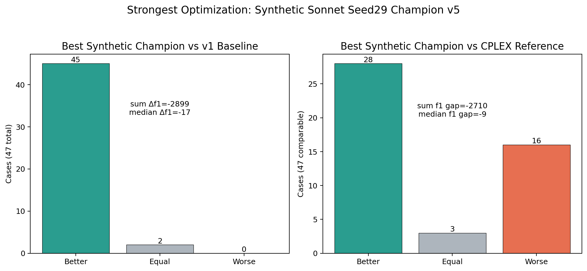
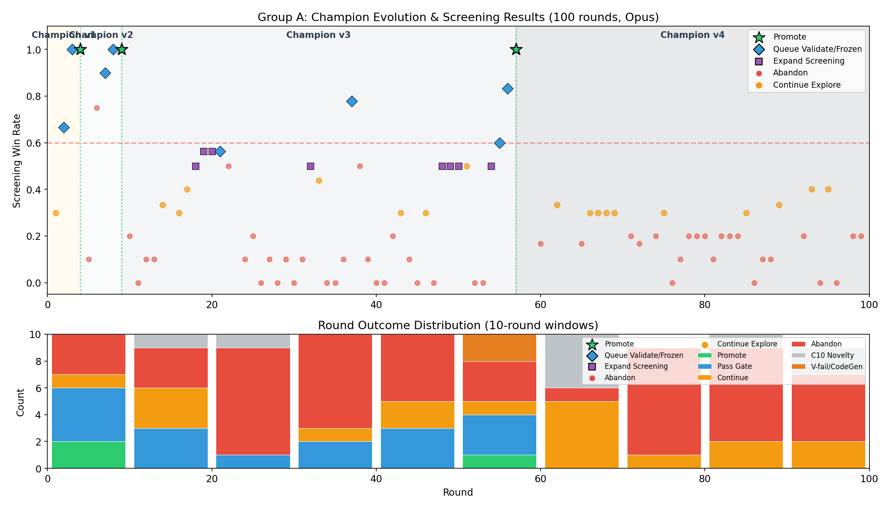
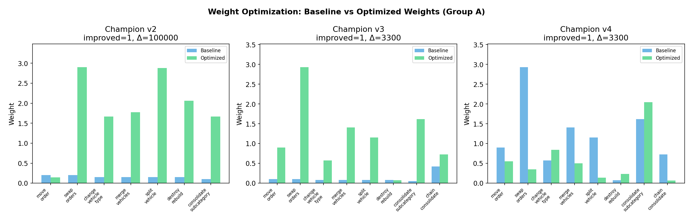
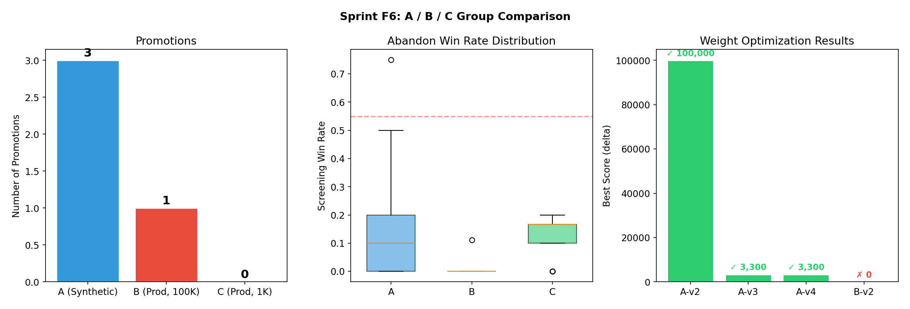
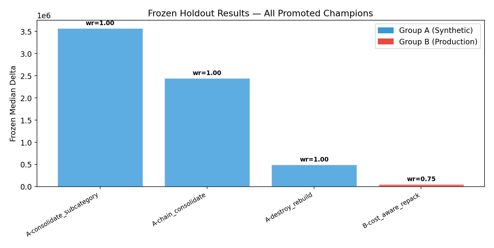

# Scion: OR × LLM 算法自动改进框架

[](https://opensource.org/licenses/MIT)
[](https://www.python.org/downloads/)
[](#)

**Scion**（分支/嫁接）是一个面向组合优化问题的 **LLM 驱动算法自动改进框架**。它通过 LLM 的先验知识与推理能力，在人类定义的"算法沙盒"内自主探索、验证并迭代启发式算子，并通过参数层搜索优化算子配比。

## 核心理念

与传统的纯进化算法不同，Scion 强调 **"推理驱动"** 而非随机变异：

- **LLM 作为推理主体**：利用 LLM 对业务逻辑的理解，提出改进假设（Hypothesis），而不仅仅是随机修改代码
- **严格的实验协议**：三级过滤机制（Screening → Validation → Frozen Holdout）控制过拟合风险
- **契约式治理**：通过静态 Contract Gate 与动态 Verification Gate 强制约束算法边界，抑制 LLM 幻觉
- **两层嵌套搜索**（v0.2）：外层 LLM 搜索算子结构，内层优化算子权重配比

## v0.3 最终结果

v0.3 将 Scion 从仓配 VNS 原型推进到工程化框架：研究对象在 `surrogate/`，框架逻辑在 `scion/scion/`，并支持 adapter-driven objective policy、synthetic/production protocol 分离、sync weight optimization、完整 metrics lineage 和 LLM trace。

最终验证：

| 维度 | 结果 |
|---|---|
| Formal validation | 12/12 campaigns completed |
| Synthetic | 6/6 campaigns promoted, 10 total promotions |
| Production rerun | Sonnet 3/3 promotions, GPT-mini 0/3 |
| Evidence gate | production rerun `bad metrics = 0` |
| Best synthetic champion | `sonnet-4-6_synthetic_seed29`, final `v5_r0` |

最强 synthetic champion 相比 v1 baseline：

```text
better = 45 / 47 cases
equal  = 2 / 47 cases
worse  = 0 / 47 cases
sum Δf1 = -2899
median Δf1 = -17
```



完整报告：

- [Agent onboarding](docs/AGENT_ONBOARDING.md)
- [evidence manifest](docs/evidence/manifest.md)
- [v0.3-final-visual-report.md](docs/archive/v0.3/v0.3-final-visual-report.md)
- [v0.3-final-12campaign-analysis.md](docs/archive/v0.3/v0.3-final-12campaign-analysis.md)
- [v0.3-production-timeout-fix-analysis.md](docs/archive/v0.3/v0.3-production-timeout-fix-analysis.md)
- [v0.4-performance-aware-plan.md](design/v0.4/v0.4-performance-aware-plan.md)
- [v0.4-cvrp-plan.md](design/v0.4/v0.4-cvrp-plan.md)
- [v0.4-evidence-harness.md](design/v0.4/v0.4-evidence-harness.md)

## v0.2 实验结果

以**仓配协同 VNS**为目标问题，v0.2 在 6 轮正式实验（F1→F6）中完成了结构搜索 + 参数搜索的完整验证。

### 标杆实验：F6 Group A（合成数据，100 rounds，Opus）

🏆 **3 次 Champion 晋升**，全部 Frozen Holdout win_rate=1.0：

| 版本 | 算子 | Frozen wr | Frozen Median Δ |
|------|------|-----------|-----------------|
| v1→v2 | ConsolidateSubcategory | **1.00** | **3,575,000** |
| v2→v3 | ChainConsolidate | **1.00** | **2,450,000** |
| v3→v4 | DestroyRebuild (subcat-aware) | **1.00** | **500,000** |

🎯 **Weight Optimization 3/3 有效**（n_evals=25），揭示算子贡献度排名：

```
consolidate_subcategory  2.05  ★ 核心算子，权重最高
change_vehicle_type      0.84
move_order               0.55
merge_vehicles           0.50
swap_orders              0.35
destroy_rebuild          0.23
split_vehicle            0.14
chain_consolidate        0.07  ← v3 晋升算子，被 v4 部分取代
```

> **关键发现**：某类算子的收益不仅来自"存在"，更来自"被高频调用"。Weight optimization 将 consolidate_subcategory 权重放大 30 倍，chain_consolidate 压低到接近 0。

### 合成 vs 生产数据对比

| 维度 | Group A（合成） | Group B（生产） | Group C（生产, cost-sensitive） |
|------|----------------|----------------|-------------------------------|
| Promotions | 3 | 1 | 0 |
| Weight opt improved | **3/3** | 0/1 | N/A |
| Abandon wr mean | 0.129 | 0.002 | 0.123 |

生产数据 splits≈0 时优化退化为 cost-only，信号弱，权重优化失灵。这揭示了评分函数需按问题特征适配（v0.3 backlog）。

### 可视化

<details>
<summary>📊 展开查看 F6 实验图表</summary>

#### Champion 演化时间线与轮次分布


#### Weight Optimization：Baseline vs Optimized 权重对比


#### A/B/C 三组对比


#### Frozen Holdout 结果


</details>

## 系统架构

```
┌─────────────────────────────────────────────────────────────┐
│                    Campaign Manager                         │
│  (Branch lifecycle, round scheduling, budget control)       │
├─────────────────────────────────────────────────────────────┤
│                                                             │
│  ┌──────────┐   ┌──────────┐   ┌──────────┐   ┌─────────┐│
│  │ Creative │   │ Contract │   │  Verify  │   │Decision ││
│  │  Layer   │──>│   Gate   │──>│   Gate   │──>│  Layer  ││
│  │  (LLM)   │   │ (Static) │   │(Dynamic) │   │(Oracle) ││
│  └──────────┘   └──────────┘   └──────────┘   └─────────┘│
│       │                                            │       │
│       │         ┌──────────────────┐               │       │
│       └────────>│  Experiment      │<──────────────┘       │
│                 │  Protocol        │                        │
│                 │  (3-stage eval)  │                        │
│                 └──────────────────┘                        │
│                         │                                   │
│                 ┌───────┴────────┐                          │
│                 │  Weight Opt    │  ← v0.2 新增             │
│                 │  (on promote)  │                          │
│                 └────────────────┘                          │
├─────────────────────────────────────────────────────────────┤
│  Lineage (SQLite) │ Runtime (subprocess) │ Config (Pydantic)│
└─────────────────────────────────────────────────────────────┘
```

### 分层控制

1. **Creative Layer (LLM, Tainted)**：Hypothesis 提出 + Code 生成 + Saturation Signal + Search Memory
2. **Gate Layer (Static & Dynamic)**：Contract Gate (C1-C10) + Verification Gate (V3-V8) + FailureRouter (四层分类)
3. **Protocol Layer (Statistical)**：三级实验协议 + Case-level 统计 + Bootstrap CI
4. **Decision Layer (Oracle)**：DecisionFeatures（纯数值） + 字典序多目标
5. **Parameter Layer (v0.2)**：Weight Optimization（promote 后触发，25 次 random search 评估）

### 关键设计决策

- **Decision Input Guard**：Decision Layer 仅接收数值化的 DecisionFeatures，屏蔽 LLM 文本干扰
- **两轮 Proposal**：Round 1 Hypothesis（假设） → Round 2 Code（实现）
- **分支内迭代演化**：方案在分支内迭代，不是每次从 champion 重新分叉
- **Champion 是池级别**：不是单个算子，而是整个 operator pool + weights 的快照
- **字典序多目标**：业务聚合（subcategory splits）> 成本（total cost）> 效率（solve time）
- **两层嵌套搜索**：外层 LLM 搜结构（发现算子），内层算法搜参数（优化权重）

## 快速开始

### 安装

```bash
git clone https://github.com/xiaojiyao777/or-autoresearch-agent.git
cd or-autoresearch-agent/scion
pip install -e .
```

### 运行 Campaign

```bash
# Full campaign (需要 LLM API key)
export SCION_API_KEY="your-api-key"
export SCION_MODEL="claude-opus-4-6"
cd scion && python run_v3_campaign.py 30

# 指定生产数据协议
export SCION_PROTOCOL="problems/warehouse_delivery/protocol_prod.yaml"
export SCION_SPLIT_MANIFEST="problems/warehouse_delivery/split_manifest_prod.yaml"
python run_v3_campaign.py 100
```

### 运行测试

```bash
cd scion
python -m pytest tests/unit/ -q
```

## 项目结构

```
scion/
├── scion/                    # 核心框架（57 个 Python 文件，~11,400 行）
│   ├── core/                 # Campaign, Branch, Decision, Scheduler, Termination, Features
│   ├── config/               # ProblemSpec, ProtocolConfig, SplitManifest, SeedLedger (Pydantic v2)
│   ├── contract/             # ContractGate (C1-C10 静态检查)
│   ├── verification/         # VerificationGate (V3-V8: feasibility, objective, state, nondeterminism, perf)
│   ├── protocol/             # ExperimentProtocol (三级实验), Evaluation (字典序), Stats (bootstrap CI)
│   ├── proposal/             # LLMClient, CreativeLayer, ContextManager, SearchMemory, Saturation
│   ├── parameter/            # WeightOptimizer, Evaluator (v0.2 新增)
│   ├── runtime/              # SubprocessRunner, WorkspaceMaterializer, PoolManager
│   ├── failure/              # FailureRouter (四层分类 + escalation + infra detection)
│   ├── lineage/              # SQLite Registry, BranchStore, ChampionStore, HypothesisStore
│   ├── cli/                  # Typer CLI (init/run/inspect/report)
│   └── tests/                # unit / integration tests
├── problems/                 # 问题配置 (YAML)
│   └── warehouse_delivery/   # 仓配协同 VNS：protocol + split_manifest + instances
├── docs/                     # 实验文档、可视化、模块理解指南
│   ├── figures/              # 实验结果图表
│   ├── v0.3-final-visual-report.md
│   └── archive/              # 历史实验与设计文档
├── design/                   # 架构设计文档
│   ├── scion-architecture-v3.md  # 基石架构
│   └── scion-v0.3-design.md      # v0.3 设计
└── reviews/                  # GPT-5.4-Pro 审核报告
```

## 目标问题：仓配协同

Scion 在**仓配协同 VNS + Solution Pool** 场景下完成验证：

- **Surrogate Solver**：VNS + Solution Pool，9 个基础算子 + LLM 发现的新算子
- **Benchmark**：48 个实例（22→990 orders），覆盖合成 + 生产数据
- **目标函数**：字典序——业务聚合 > 物流总成本 > 求解效率
- **生产数据**：引入真实生产统计特征生成的实例 + 真实日数据

## v0.4：CVRP 第二问题

v0.4 将把 **CVRP** 接入 Scion，作为第二个真实组合优化问题。这个选择替代了早期路线图中“优先接 FCMCNF + Benders”的安排；FCMCNF 会保留为后续 v1.x 的 lower-bound/decomposition track。

CVRP 的价值在于它是标准 routing 问题，具有成熟 benchmark 和经典局部搜索算子族，而且它的 route-sequence 语义与当前 warehouse assignment/bin-packing 问题明显不同。它会直接检验 `ProblemAdapter`、operator interface、verification gate、quality/runtime harness 是否真的泛化。

当前 CVRP baseline 已作为 [`../vrp/`](../vrp/) staging baseline 纳入仓库，`../vrp/cvrplib/` benchmark 原始数据不跟踪。seed0 baseline 已完成：

```text
attempted EUC_2D instances = 10330
status=ok = 10330
timeout = 0
error = 0
CVRP feasible = 10330
benchmark_feasible = 10249
```

Baseline 报告：

- [../vrp/docs/experiment_results_seed0.md](../vrp/docs/experiment_results_seed0.md)
- [docs/evidence/manifest.md](docs/evidence/manifest.md)
- [design/v0.4/v0.4-evidence-harness.md](design/v0.4/v0.4-evidence-harness.md)

接入 Scion 后，v0.4 不只记录 promotion 次数，还会对每个 campaign final champion 做固定评估集上的 baseline quality/runtime 对比。

## 开发路线

- [x] **v0.1 MVP**：核心循环、Contract Gate、三级实验协议、SQLite Lineage ✅
- [x] **v0.1.1 调优**：ContextManager 重写、prompt caching、subprocess timeout ✅
- [x] **v0.2 参数层**：Weight Optimization、FailureRouter 升级、Pro 审查整改、生产数据支持 ✅
- [x] **v0.3 工程化框架**：adapter/objective 泛化、production protocol、sync weight opt、完整证据 gate ✅
- [ ] **v0.4 性能感知优化 + CVRP 接入**：runtime/complexity 作为公共优化维度，并用 CVRP 检验第二问题泛化
- [ ] **v1.0 多问题证据固化**：warehouse + CVRP 跨问题验证、机制研究、工程化收敛

## 实验历史

| 实验 | 轮数 | 模型 | Promotes | Weight Opt | 关键发现 |
|------|------|------|----------|-----------|---------|
| F1 | 30r | Opus | 2 | — | 首次完整 v0.2 验证 |
| F4 A/B | 200r×2 | Opus | 3/1 | 未验证 | 发现 K 系列 bug |
| F5 A/B | 186r+200r | Opus | 3/1 | 0/4 (n=9) | L 修复验证，weight opt 评估不足 |
| **F6 A** | **98r** | **Opus** | **3** | **3/3 (n=25)** | **权重优化有效，算子贡献度排名** |
| **F6 B** | **100r** | **Opus** | **1** | **0/1** | **生产数据 cost 信号弱** |
| **F6 C** | **30r** | **Opus** | **0** | **N/A** | **SPLITS_WEIGHT 配置验证** |

## 相关工作

| 特征 | LLM+进化算法 (FunSearch/EoH/ReEvo) | Scion |
|------|-----------------------------------|-------|
| LLM 角色 | 变异算子（无记忆） | 推理主体（有记忆） |
| 搜索策略 | 随机变异 + 适应度选择 | 假设驱动 + 统计检验 |
| 安全控制 | 无/弱 | Contract Gate + Verification Gate |
| 评估方式 | 单轮 fitness | 三级实验协议 + bootstrap CI |
| 决策机制 | LLM 参与 | 纯数值 Oracle（Decision Input Guard） |
| 参数优化 | 无 | Weight Optimization（两层嵌套搜索） |

## 当前状态

**v0.3 完成** (2026-04-28)

- 框架闭环完成：hypothesis -> code -> verification -> protocol -> promote -> sync weight opt -> lineage。
- Synthetic 优化能力明确成立。
- Production 在 Sonnet 下可产生完整证据的改进；GPT-mini 仍受代码生成质量限制。
- 生产 timeout / incomplete evidence 问题已修复并记录到 v0.4 performance-aware plan。
- v0.4 已确定引入 CVRP 作为第二真实问题，详见 [v0.4-cvrp-plan.md](design/v0.4/v0.4-cvrp-plan.md)。

## 开源协议

基于 MIT License 开源。

---

*Built with precision — Scion Framework v0.3*
