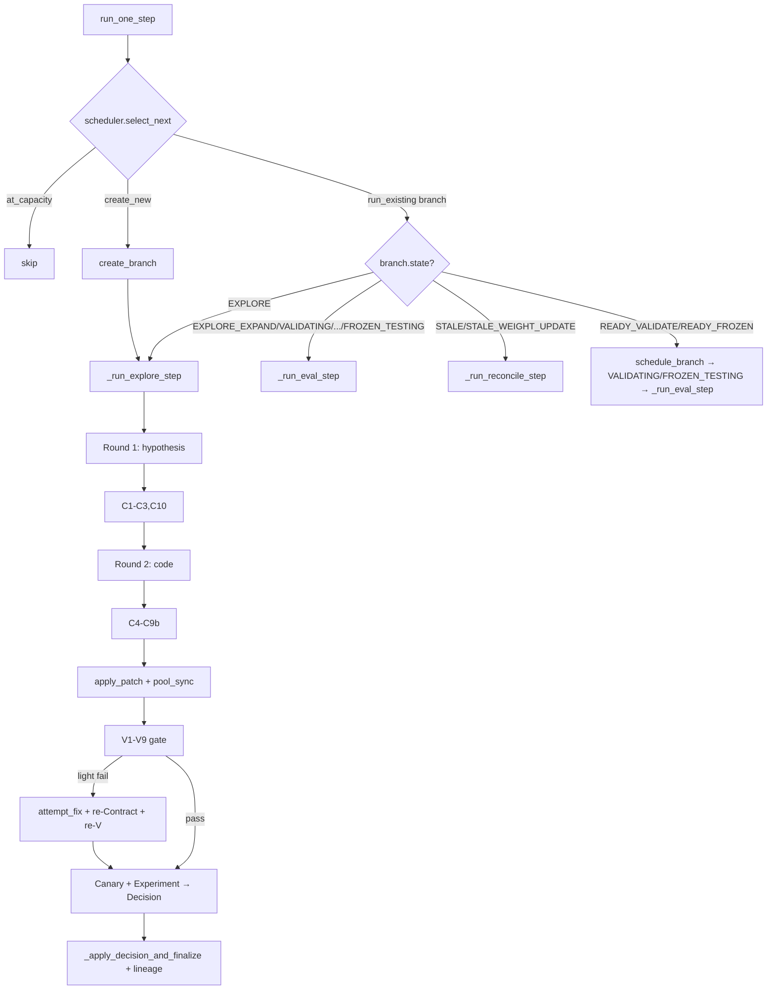

# Scion v0.2-final - 权威现状说明(代码考古版)

*Date: 2026-04-18*
*Maintainer: Cris*
*Scope: Sprint A → Sprint M(commit cf50429)*
*Ground truth: `/home/clawd/research/or-autoresearch-agent/scion/scion/**/*.py`*

> **阅读须知**。本文档以源码为权威(文档与代码冲突时一切以代码为准),不重复
> `scion-architecture-v3.md` 中已经写明的设计决策,仅记录"代码当前实际是什么样"。
> 所有条目均附源码位置(文件:行号)。

---

## 0. 代码规模速览

- 核心包 `scion/scion/`:12 子模块,约 **11 400** 行产品代码 + 5 300 行测试代码。
- 主循环 `core/campaign.py` 单文件 **2 375 行**(campaign.py:1-2375)。
- 测试数量:`scion/tests/` 共 **39** 个测试文件,Sprint M 合并后跑通 **289** 个单元测试。

```
模块行数(产品代码)
  core/          3 545   campaign.py 2 375 + models.py 360 + branch.py 246 + 其他
  proposal/      3 401   context_manager.py 1 105 + llm_client.py 497 + research_log.py 491 + ...
  cli/           1 027
  runtime/         947
  contract/        498
  verification/  1 174
  protocol/        790
  lineage/         743
  parameter/       503
  config/          449
  failure/         179
```

---

## 1. 模块全景图

| 模块 | 文件数 | 职责 | 关键入口 |
|---|---:|---|---|
| `core/` | 8 | 主循环、状态机、决策引擎、特征抽取、终止判断、stagnation 检测 | `CampaignManager`、`BranchController`、`DecisionEngine`、`SafeFeatureExtractor`、`TerminationChecker`、`StagnationDetector`、`Scheduler` |
| `config/` | 4 | Pydantic 配置加载(problem/protocol/split/seed) | `ProblemSpec.from_yaml`、`ProtocolConfig.from_yaml`、`SplitManifest.from_yaml`、`SeedLedger.from_yaml` |
| `contract/` | 1 | 静态闸门 C1-C10,检查 hypothesis/patch schema + AST + 白名单 | `ContractGate.validate_hypothesis` / `.validate_patch` |
| `verification/` | 9 | 运行时闸门 V1-V9,syntax→interface→tests→state_mutation→feasibility→objective→nondeterminism→perf | `VerificationGate.run`(检查按序 fail-fast) |
| `protocol/` | 4 | 三级 A/B 实验协议 + 字典序比较 + bootstrap CI + gate 判定 | `ExperimentProtocol.run_canary`、`run_experiment`、`gates.screening_gate/validation_gate/frozen_gate` |
| `proposal/` | 9 | LLM 接入、schema、上下文构造、search memory、saturation、research log、classifier | `CreativeLayer.generate_hypothesis/generate_code/fix_code`、`ContextManager.build_hypothesis_context/build_code_context/build_fix_context`、`LLMClient.call_with_tool` |
| `runtime/` | 4 | workspace 物化、算子池 YAML 注册表、subprocess runner、ResourceLimits | `WorkspaceMaterializer.apply_patch/create_branch_workspace/freeze_snapshot`、`LocalSubprocessRunner.run_solver`、`PoolManager`、`read_registry/read_weights/update_weights` |
| `failure/` | 1 | 失败路由表(proposal/contract/v_light/v_heavy/infra/evaluation/search_guidance) | `FailureRouter.route` |
| `lineage/` | 4 | SQLite append-only 事件 + Branch/Hypothesis/Champion 表 | `LineageRegistry`、`BranchStore`、`HypothesisStore`、`ChampionStore` |
| `parameter/` | 3 | 权重搜索空间 + 随机/贝叶斯优化器 + evaluator | `RandomLocalWeightOptimizer`、`BayesianWeightOptimizer`、`evaluate_weights`、`collect_baseline` |
| `memory/` | 1 | (空壳;HypothesisStore 已在 lineage 里) | - |
| `cli/` | 1 | typer CLI:init / run / inspect / report / postmortem / optimize-weights | `scion init/run/...` |

---

## 2. 数据模型清单

全部定义位于 `core/models.py`(除 `FailureAction`、`CaseLevelResult`)。

### 2.1 枚举

| 枚举 | 值 | 位置 |
|---|---|---|
| `BranchState` | `NEW / EXPLORE / EXPLORE_EXPAND / READY_VALIDATE / VALIDATING / VALIDATING_EXPAND / READY_FROZEN / FROZEN_TESTING / PROMOTED / ABANDONED / STALE / STALE_WEIGHT_UPDATE / BLOCKED_INFRA` | models.py:10-22 |
| `ExperimentStage` | `SCREENING / VALIDATION / FROZEN` | models.py:31-34 |
| `Decision` | `CONTINUE_EXPLORE / EXPAND_SCREENING / QUEUE_VALIDATE / EXPAND_VALIDATION / QUEUE_FROZEN / PROMOTE / ABANDON` | models.py:36-43 |
| `ExperimentState` | `CREATED / RUNNING / COMPLETED / FAILED_INFRA / FAILED_VERIFICATION`(仅测试用,不在主循环) | models.py:24-29 |

### 2.2 提案(LLM 产出,tainted)

| 类型 | 关键字段 | 位置 |
|---|---|---|
| `HypothesisProposal` | `hypothesis_text, change_locus, action, target_file, predicted_direction, target_weakness, expected_effect, suggested_weight` | models.py:47-55 |
| `PatchProposal` | `file_path, action{modify/create/delete}, code_content, test_hint` | models.py:57-61 |

### 2.3 Gate / 协议结果

| 类型 | 摘要 | 位置 |
|---|---|---|
| `CheckResult` | 单项检查:name/passed/severity{light,heavy}/detail/elapsed_ms | models.py:65-70 |
| `ContractResult` | passed + tuple[CheckResult] + failure_reason | models.py:72-75 |
| `VerificationResult` | passed + checks + failure_severity + first_failure | models.py:77-80 |
| `CanaryResult` | passed + reason | models.py:82-84 |
| `EvalStats` | n_cases/wins/losses/ties/win_rate/median_delta/ci_low/ci_high | models.py:86-93 |
| `ProtocolResult` | stage + stats + gate_outcome{pass/fail/unclear/expand} + reason_codes + exposed_summary + raw_metrics_ref + pair_feedback + case_feedback + pattern_summary | models.py:95-106 |
| `ObjectiveBreakdown` | candidate/champion splits + cost + delta + decisive_objective | models.py:111-122 |
| `PairwiseCaseFeedback` | case_id + seed + comparison + delta + breakdown + case_features | models.py:124-130 |
| `CaseAggregateFeedback` | case_id + n_pairs + wins/losses/ties + win_rate + dominant_result + decisive_objective + median_delta_* + seed_consistency | models.py:132-148 |
| `ScreeningPatternSummary` | wins/losses/mixed 分层 + by_decisive_objective + by_size_bucket + consistent_* + key_observations | models.py:150-162 |

### 2.4 Decision Layer 白名单输入

| `DecisionFeatures` | `branch_id/hypothesis_action/stage/contract_passed/verification_passed/canary_passed/n_cases/win_rate/median_delta/ci_low/ci_high/stale/recent_retry_count/recent_failure_codes/budget_remaining_ratio/expand_count` | models.py:166-183 |
| `DecisionOutcome` | `decision + reason_codes + features_snapshot` | models.py:185-188 |

`features.py:9-13` 在 `_validate_no_free_text` 中对 `branch_id`/`hypothesis_action`/`stage`/`recent_failure_codes` 做
运行时断言,任何未枚举字段或非 UUID 的 branch_id 都抛 `DecisionInputGuardError`。

### 2.5 Campaign / Branch 状态

| `OperatorConfig` | name/file_path/category/weight/class_name | models.py:190-195 |
| `ChampionState` | version/operator_pool/solver_config_hash/code_snapshot_path/code_snapshot_hash/promotion_experiment_id/promoted_at | models.py:198-206 |
| `Branch` | branch_id/state/base_champion_id+hash/current_code_hash/last_clean_code_hash/retry_count/expand_count/failure_codes/created_at/updated_at/direction/pending_retry/blocked_rounds/consecutive_llm_retries/infra_block_count | models.py:208-228 |
| `HypothesisRecord` | hypothesis_id/branch_id/change_locus/action/status/target_file/parent_hypothesis_id/suggested_weight/hypothesis_text/family_id/created_at/base_champion_version | models.py:243-256 |
| `HypothesisFamily` | family_id/mechanism_label/action_pattern/locus_pattern/evidence_count/statuses | models.py:230-240 ⚠️ **定义存在但从未入库 / 从未写入** |
| `StepRecord` | round_num/branch_id/hypothesis/patch/contract_passed/verification_passed/protocol_result/decision/failure_stage/failure_detail/verification_detail/code_archive_ref/cache_stats/hypothesis_id/decision_reason_codes | models.py:295-337 |

### 2.6 运行时 / 附加

| `SolverOutput` | vehicles/assignment/objective/feasible | models.py:260-265 |
| `RunResult` | success/exit_code/stdout/stderr/elapsed_ms/output/output_path/error_category{timeout/oom/crash} | models.py:269-278 |
| `FailureEvent` | category{proposal/contract/verification_light/verification_heavy/infra/evaluation}/detail/timestamp/retryable | models.py:280-285 |
| `WeightConfig` | weights + source{uniform/optimized/manual} + optimization_id | models.py:288-292 |
| `WeightOptimizationResult` | baseline_weights/best_weights/baseline_score/best_score/improved/n_evaluations/elapsed_seconds/observations_ref | models.py:295-303 |

### 2.7 其它不在 models.py 的数据类

- `FailureAction`(failure/router.py:24-30):`action + consumes_budget + writes_hypothesis_memory + max_retries_remaining + escalation_level`
- `CaseLevelResult`(protocol/experiment.py:28-32):`case_id + comparison + delta`
- `StagnationSignal` / `CampaignDiagnosis`(core/stagnation.py:13-27)
- `SaturationSignal`(proposal/saturation.py:9-15)
- `FamilyEntry`(proposal/search_memory.py:48-67):这是 SearchMemory 内部结构,**不持久化**
- `BranchTrajectory`(proposal/research_log.py:18-26)

---

## 3. 主循环真实流程

主循环入口 `CampaignManager.run(max_rounds)`(campaign.py:259-285),一次调用 `run_one_step()`
(campaign.py:287-367)做一步调度。

### 3.1 `run()`(最外层循环)

```
while round in range(max_rounds):
    if should_stop(): break                      # 终止/预算/stagnation + I4 一次 escape
    if circuit_breaker.is_tripped: break         # 连续 3 次 LLM failure 熔断
    result = run_one_step()
    if result.stopped: break
    _run_stagnation_check()                      # T25 → T23 诊断(critical signal 写 diagnostics)
    _check_soft_stagnation()                     # I3 T4 soft-abandon 累计 → 强制下一 branch 切 locus
_write_campaign_summary()                        # 写 campaign_summary.json
for t in pending_weight_opt_threads: t.join(600) # 等待后台 weight-opt 收尾,每线程最长 10 分钟
```

### 3.2 `run_one_step()` 的分发(campaign.py:287)

1. 如果 `should_stop()` 为真,返回 `StepResult(action="stopped")`。
2. `_tick_blocked_branches()`:把 `BLOCKED_INFRA` 的 `blocked_rounds++`,满 3 轮自动 `unblock_infra`。
3. `scheduler.select_next(active_branches)` 得到 `SchedulerAction`。
   - `at_capacity` → skip;
   - `create_new` → 新建 branch(`BranchController.create_branch`),进入 `_run_explore_step`;
   - 否则拿到 `branch`。
4. 根据 `branch.state` 分派:
   - `READY_VALIDATE / READY_FROZEN` → `branch_ctrl.schedule_branch()` 推进到 `VALIDATING / FROZEN_TESTING`。
   - `STALE / STALE_WEIGHT_UPDATE` → `_run_reconcile_step`。
   - `EXPLORE` → `_run_explore_step`。
   - `EXPLORE_EXPAND / VALIDATING / VALIDATING_EXPAND / FROZEN_TESTING` → `_run_eval_step`(复用现有 workspace+patch)。
   - 其它:返回 skip。

### 3.3 `_run_explore_step`（campaign.py:422-751）与架构 v3 §18 的映射

| §18 步骤 | 代码实现 | 一致性 |
|---|---|---|
| 1. scheduler.select | `run_one_step` 里 | ✅ |
| 2. STALE reconcile | `_run_reconcile_step`（campaign.py:845） | ✅ 但 §18 伪代码里是顶层判断，实际代码里通过 state 分派 |
| 3. Round 1 hypothesis | `_round1_generate_hypothesis`（campaign.py:1014） | ✅ |
| 4. Contract validate_hypothesis | `_contract_gate.validate_hypothesis(h, active, blacklist, rejected, champion_version)` | ✅ 但增加了 `rejected_hypotheses` + `current_champion_version` 参数（K2 引入，允许 champion 换代后重试 rejected） |
| 5. Round 2 code | `_round2_generate_code`（campaign.py:1088） | ✅ |
| 6. Contract validate_patch | `_contract_gate.validate_patch(patch)` | ✅ |
| 7. Materialize | `_setup_workspace` + `materializer.apply_patch` | ✅ |
| 7.5 **Pool registry sync** | `_sync_pool_registry` 通过 `PoolManager` 生成 `registry.yaml` | ⚠️ §18 未提，G4 增加（WorkspaceMaterializer 原来只处理 create 的 registry append，remove/modify 会错） |
| 8. Verification | `_vgate.run(candidate, champion, patch)` | ✅ 含 light 失败可 `_attempt_fix` + T01 在 apply fix 前重跑 ContractGate |
| 9. Canary | `_experiment_protocol.run_canary(candidate, champion)` | ✅ |
| 10. Experiment | `_experiment_protocol.run_experiment(stage, ...)` | ✅ 调用前 J4 并发闸门:重新拉 branch，如被 async weight-opt 置为 STALE 则 `skip` |
| 11. Extract features | `_feature_extractor.extract(branch, hyp.action, contract, verify, canary, protocol, budget)` | ✅ |
| 12. Decision | `_decision_engine.decide(features)`（campaign.py:1179 `_evaluate`） | ✅ 决策后 I1 T4 soft-abandon 旁路（wr<0.3 → 直接 ABANDON + 不计入 hard-stagnation） |
| 13. Lineage record | `_record_step_lineage`（campaign.py:1357） + `_record_step` 写 StepRecord + `_hyp_store.save / mark_status` | ✅ |
| 14. State transition | `_apply_decision_and_finalize`（campaign.py:1429） | ✅ |

**主要演化差异**(代码 vs §18 伪代码):

- **Pending hypothesis 重试路径**(campaign.py:417-475):当 code 生成失败时把 `(hypothesis, h_record, failure_detail)` 塞进 `_pending_hypotheses[bid]`,下一轮跳过 Round 1 直接重跑 Round 2;但必须先再跑一次 `validate_hypothesis` 避免 C10 冲突。
- **并发控制边界**:`_champion_lock`(threading.Lock)保护 `_champion` 读写,每个对 `self._champion` 的访问都通过锁(campaign.py:374, 599, 935, 948, ...)。LLM 调用前后锁释放。
- **Branch 历史 & 迭代**:`CONTINUE_EXPLORE` 分支保留 workspace 当且仅当 `verification_passed AND win_rate>0`(campaign.py:1321-1333)--这正是 §11.2 "有正信号就在 branch 内继续演化" 的实现。
- **_record_step_lineage 写两条**:一条 `experiment_event`,一条 `decision`(以 `event_kind='decision'` 区分)。

### 3.4 关键流程图(简化)



---

## 4. 状态机真实定义

### 4.1 `BranchState` 列表

见 §2.1。新增于 v0.2:`STALE_WEIGHT_UPDATE`(J4 为异步权重优化触发的 stale 保留的独立语义)。

### 4.2 转换表(branch.py:22-55)

| Decision | 起点 state | 终点 state |
|---|---|---|
| `CONTINUE_EXPLORE` | `EXPLORE` / `EXPLORE_EXPAND` | `EXPLORE` |
| `EXPAND_SCREENING` | `EXPLORE` / `EXPLORE_EXPAND` | `EXPLORE_EXPAND`(自环) |
| `QUEUE_VALIDATE` | `EXPLORE` / `EXPLORE_EXPAND` | `READY_VALIDATE` |
| `EXPAND_VALIDATION` | `VALIDATING` | `VALIDATING_EXPAND` |
| `QUEUE_FROZEN` | `VALIDATING` / `VALIDATING_EXPAND` | `READY_FROZEN` |
| `PROMOTE` | `FROZEN_TESTING` | `PROMOTED` |
| `ABANDON` | 任意 | `ABANDONED` |

Scheduler 单独触发的 `schedule_branch`(branch.py:80-94):

| 起点 | 终点 |
|---|---|
| `READY_VALIDATE` | `VALIDATING` |
| `READY_FROZEN` | `FROZEN_TESTING` |
| `EXPLORE_EXPAND` | `EXPLORE` |
| `VALIDATING_EXPAND` | `VALIDATING` |

其它副作用转换(在 campaign.py 或 branch.py 里):

- `mark_all_stale(new_champion_id)` 把所有 `_ACTIVE_STATES ∩ ¬FROZEN_TESTING` 置为 `STALE`(branch.py:97-111)。
- `reconcile_stale(branch_id, success, new_champion)`:success → `EXPLORE`(可被 `_run_reconcile_step` 再 apply_decision 推到 `READY_VALIDATE`);失败 → `ABANDONED`(branch.py:115-132)。
- `block_infra(branch_id)` → `BLOCKED_INFRA`(保存 `_pre_infra_state`);`unblock_infra` 恢复。
- `_apply_soft_abandon`(campaign.py:1119-1148):T4(wr<0.3)路径直接 `apply_decision(ABANDON)`,不计入 hard-stagnation counter。

### 4.3 主循环激活状态(`_ACTIVE_STATES`)

`termination.py:17-28`:`EXPLORE, EXPLORE_EXPAND, READY_VALIDATE, VALIDATING, VALIDATING_EXPAND, READY_FROZEN, FROZEN_TESTING, STALE, STALE_WEIGHT_UPDATE, BLOCKED_INFRA`。

`branch.py:_ACTIVE_STATES`(campaign 调度用):仅前 7 个,**不含** `STALE/STALE_WEIGHT_UPDATE/BLOCKED_INFRA`。这就是为什么 `get_active_branches()` 会列出 stale/blocked(`terminal = {PROMOTED, ABANDONED}`)。

### 4.4 Scheduler 优先级(scheduler.py:14-32)

```
P1: READY_FROZEN
P2: READY_VALIDATE
P3: STALE ∪ STALE_WEIGHT_UPDATE
P4: EXPLORE / EXPLORE_EXPAND / VALIDATING / VALIDATING_EXPAND / FROZEN_TESTING
P5: create_new          当且仅当 len(branches) < max_active_branches (默认 3)
P6: at_capacity
```

BLOCKED_INFRA **不可调度**。同一 tier 内 `pending_retry=True` 优先,FIFO 兜底。

---

## 5. Gate / Protocol / Decision 接口真实形态

### 5.1 `ContractGate`(contract/gate.py:58-498)

```python
ContractGate(problem_spec: ProblemSpec)

.validate_hypothesis(
    hypothesis: HypothesisProposal,
    active_hypotheses: List[HypothesisRecord],
    blacklist: List[HypothesisRecord],
    rejected_hypotheses: Optional[List[HypothesisRecord]] = None,   # K2
    current_champion_version: int = 0,                              # K2
) -> ContractResult                                     # 检查 C1,C2,C3,C10

.validate_patch(patch: PatchProposal) -> ContractResult  # 检查 C4,C5,C6,C7,C8,C9,C9b
```

**10 项检查**(以实际 `_c*` 方法命名为准):

| Code | 检查 | severity | 作用 |
|---|---|---|---|
| C1_schema | hypothesis_text/change_locus/action 非空、action 枚举 | heavy | gate.py:105-122 |
| C2_change_locus | 在 `problem_spec.operator_categories` 内 | heavy | gate.py:125-133 |
| C3_action_target | modify/remove 必须带 target_file | heavy | gate.py:136-149 |
| C4_file_whitelist | file_path 匹配 `editable` glob | heavy | gate.py:152-163 |
| C5_frozen_files | file_path 不匹配 `frozen` glob | heavy | gate.py:166-174 |
| C6_ast_syntax | `ast.parse(code_content)` | light | gate.py:177-186 |
| C7_interface | 找到 class → 必须有 `execute(self, solution, rng)` | light | gate.py:189-221 |
| C8_import_whitelist | top-level 模块在 whitelist 内 | heavy | gate.py:224-252 |
| C9_sensitive_api | 检测 `subprocess/socket/eval/exec`、`os.system/popen/...`、`open(write_mode)` | heavy | gate.py:255-298 |
| C9b_non_rng_random | 检测 `uuid.uuid4()`、`random.*`、`os.urandom`、`secrets.token_*`;`rng.*` 免检,支持 alias | heavy | gate.py:301-369 |
| C10_novelty | 对(locus, action, target_file[+text[:50] for create_new])做去重;rejected 仅在同 champion 版本下生效(K2) | light | gate.py:372-412 |

Contract 失败 `failure_reason` 里含 `"C10_novelty"` 会被 campaign.py:481 `_cat = "search_guidance"` 特判,走 search_guidance 路径(FailureRouter 不把它算 infra streak)。

### 5.2 `VerificationGate`(verification/gate.py:40-155)

```python
VerificationGate(
    problem_spec: Optional[ProblemSpec] = None,
    runner: Optional[Runner] = None,
    metrics_dir: Optional[str] = None,
)

.run(candidate_workspace: str, champion_workspace: str, patch: PatchProposal) -> VerificationResult
```

**检查顺序(fail-fast)**:

| Gate.py 行 | 代码名 | 实际模块 | severity | 说明 |
|---|---|---|---|---|
| 78 | V1_syntax | syntax.py | light | 复跑 C6 |
| 84 | V2_interface | interface.py | light | 运行时 import + AST 回退 |
| 91 | V3_unit_tests | tests.py | light | `pytest unit_test_path` |
| 97 | V4_regression_tests | tests.py | light | `pytest regression_test_path` |
| 108 | V5_state_mutation | state_mutation.py | heavy | **proxy**:跑一次 solver,检查 assignment ↔ vehicle.order_ids 一致性(非真正 input-mutation 监控,v0.3 改名 `V5_solution_consistency`) |
| 114 | V6_feasibility | feasibility.py(内部名仍叫 V3_feasibility) | heavy | canary solver 输出送 `oracle.check_feasibility` |
| 120 | V7_objective | objective.py(内部名 V4_objective) | heavy | `oracle.recompute_objective` 比对 solver 自报 splits/cost |
| 127 | V8_nondeterminism | nondeterminism.py | heavy | 同 seed 双跑,objective 除 `solve_time_ms` 外必须相等 |
| 134 | V9_perf_guard | perf_guard.py(内部名 V6_perf_guard) | heavy | candidate 耗时 ≤ champion × 5 |

⚠️ **Naming gap**:`gate.py` 的外部排序是 V1-V9,但各模块内部常量仍有 V3/V4/V6 老命名(feasibility/objective/perf)。`state_leak.py` 已标记 `DeprecationWarning`(state_leak.py:1-18),被 `nondeterminism.py` 取代但文件仍在。

当 `runner is None or problem_spec is None`:V3-V9 全部跳过(gate.py:101);`canary_case_path` 为空:V5-V9 skipped(各 `check_*` 自跳)。

### 5.3 `ExperimentProtocol`(protocol/experiment.py:96-299)

```python
ExperimentProtocol(
    protocol_config: ProtocolConfig,
    split_manager: SplitManager,
    seed_ledger: SeedLedger,
    runner: Runner,
    time_limit_sec: int = 300,
    metrics_dir: str = "/tmp/scion_metrics",
)

.run_canary(candidate_ws, champion_ws) -> CanaryResult
# 在 split_manifest.canary × seed_ledger.canary 上跑 A/B;
# 触发 veto 的唯一条件:champion feasible 而 candidate infeasible。
# 两个 canary 集合必填(空 → raise ValueError),G3 引入以隔离 canary 和 screening。

.run_experiment(
    stage: ExperimentStage,
    candidate_ws: str,
    champion_ws: str,
    hypothesis_action: str,
    expand: bool = False,
    expand_round: int = 1,
) -> ProtocolResult
```

- **case 选择**(`_select_cases`, protocol/experiment.py:185-215):
  - Screening / non-expand: `n_cases_create`(create_new)或 `n_cases_modify`(默认 10/6)。
  - Screening / expand: `expand_to_create`(默认 16)或 `expand_to_modify`(默认 10)。
  - Validation: `n_cases`(12) 或 `expand_to`(20)。
  - Frozen: `n_cases`(12)。
  - 生产 `protocol.yaml` 当前实际为 screening 6/10/2seeds, validation 6×3, frozen 4×3。
- **seed 集**:`seed_ledger.{stage}`,不随 expand 变化(T4)。
- **case-level 聚合**:`_aggregate_pairs_to_case_level`(protocol/experiment.py:301-334)按 `case_id` 把跨 seed 的 pair 做多数投票得到 win/loss/tie,`delta` 取跨 seed 中位数;`EvalStats` 在 case-level 上算(T2 完全接通 ✅)。
- **暴露控制**:screening 返回 `pair_feedback + case_feedback + pattern_summary`;validation/frozen 只返回 `stats + gate_outcome`(实验上下文管理器再做一次)。
- **`compute_delta`**(protocol/evaluation.py:58-95):字典序 delta。splits 不等 → `(champ-cand) * SPLITS_WEIGHT`(env `SCION_SPLITS_WEIGHT`,默认 `100000`);splits 相等 → `champ_cost - cand_cost`。这是 weight optimization 和 protocol 共用同一 scoring 的根因(v0.3 P0)。

**Gate 判定**(protocol/gates.py):

- `screening_gate`: wr ≥ threshold(0.667) 且 median_delta ≥ min_practical_delta(0.001) → `pass`;wr < 0.5 → `fail`;0.5 ≤ wr < threshold → `expand`;wr ≥ threshold 但 delta 太小 → `unclear`。
- `validation_gate`: wr ≥ 0.667 且 ci_low ≥ 0 → `pass`;ci_high < 0 → `fail`;wr ≥ threshold 且 ci_low < 0 → `expand`;其它 → `fail`。
- `frozen_gate`: ci_low ≥ 0 → `pass`;ci_high < 0 → `fail`;ci 跨 0 → `fail` unclear。

### 5.4 `DecisionEngine`(core/decision.py:9-122)

```python
DecisionEngine(config: ProtocolConfig)

.decide(features: DecisionFeatures) -> DecisionOutcome
```

- Pre-flight:`!contract_passed → ABANDON[CONTRACT_FAILED]`;`!verification_passed → ABANDON[VERIFICATION_FAILED]`;`!canary_passed → ABANDON[CANARY_FAILED]`;`budget_remaining_ratio ≤ 0 → ABANDON[BUDGET_EXHAUSTED]`。
- `_decide_screening`:
  - `wr ≥ 0.667 AND md ≥ 0.001` → `QUEUE_VALIDATE[SCREENING_PASS]`。
  - `wr ≥ 0.667 AND md ≥ 0`(tie 拉低 median) → `QUEUE_VALIDATE[SCREENING_PASS_MARGINAL_DELTA]`。
  - `wr ≥ 0.667 AND md < 0` → `EXPAND_SCREENING[SCREENING_EXPAND_DELTA]`。
  - `0.5 ≤ wr < threshold AND expand_count < 3` → `EXPAND_SCREENING[SCREENING_EXPAND]`。
  - `0.5 ≤ wr < threshold AND expand_count ≥ 3 AND wr ≥ threshold-0.05` → `QUEUE_VALIDATE[SCREENING_EXPAND_EXHAUSTED_BORDERLINE]`。
  - `0.5 ≤ wr < threshold AND expand_count ≥ 3` → `CONTINUE_EXPLORE[SCREENING_EXPAND_EXHAUSTED]`。
  - `wr < 0.5` → `CONTINUE_EXPLORE[SCREENING_FAIL_WIN_RATE]`(**会被 T4 在 campaign.py:1083 重写为 ABANDON**)。
  - `wr IS None` → `CONTINUE_EXPLORE[NO_SCREENING_STATS]`。
- `_decide_validation`:
  - `wr ≥ 0.667 AND ci_low ≥ 0` → `QUEUE_FROZEN[VALIDATION_PASS]`。
  - `ci_high < 0` → `ABANDON[VALIDATION_FAIL_CI_NEGATIVE]`。
  - `wr ≥ threshold AND ci_low < 0 AND expand_count ≥ 1` → `QUEUE_FROZEN[VALIDATION_EXPAND_EXHAUSTED_PASS]`。
  - `wr ≥ threshold AND ci_low < 0 AND expand_count < 1` → `EXPAND_VALIDATION[VALIDATION_EXPAND]`。
  - 其它 → `ABANDON[VALIDATION_FAIL_WIN_RATE]`。
- `_decide_frozen`:`ci_low ≥ 0 → PROMOTE[FROZEN_PASS]`;否则 `ABANDON[FROZEN_FAIL]`。

---

## 6. LLM 相关组件

### 6.1 `LLMClient`(proposal/llm_client.py:79-450)

- 真正的 API 路径:默认 `aihubmix` 的 Anthropic 兼容端点(`SCION_BASE_URL=https://aihubmix.com`),默认模型 `claude-opus-4-6`。
- 两种调用模式:
  1. `call(prompt, response_schema, model, system_blocks, priority)`:直接拼 system+user,解析 markdown 围栏 + JSON。
  2. `call_with_tool(prompt, tool, model, system_blocks, priority)`:**当前主力路径**,用 Anthropic tool_use 约束输出 -- CreativeLayer 三个方法都走这条(engine.py:55, 72, 82)。
- 容错:
  - Timeout → 指数退避 `_BACKOFF_DELAYS=(5,15)`,`max_retries=2`。
  - Rate limit (429) → 读 `Retry-After` header sleep 后不计数重试;`priority="background"` 直接抛。
  - **HTTP 403 + "balance/insufficient"** → 抛 `LLMBalanceError`(campaign.py:883 调用时转 `_balance_exhausted=True` + `circuit_breaker.record_failure`,此后 `should_stop` 因为 circuit breaker 立刻停)。T6 引入,M 合入。
  - `stop_reason in ("max_tokens","length")` → **截断恢复**:`max_tokens` 翻倍(最大 16384)最多 2 次(`MAX_TRUNCATION_RETRIES=2`),llm_client.py:259-277。
- 缓存统计:每次 call 累加 `cache_read_tokens/cache_create_tokens/uncached_tokens`,`get_cache_stats()` 报命中率。
- 熔断:campaign.py 的 `CircuitBreaker`(阈值 3 连续 LLM 失败) + `should_stop` 检查 `is_tripped`。

### 6.2 `CreativeLayer`(proposal/engine.py:27-82)

```python
CreativeLayer(llm_client, model=None)

.generate_hypothesis(context) -> HypothesisProposal   # call_with_tool(HYPOTHESIS_TOOL)
.generate_code(context)       -> PatchProposal         # call_with_tool(PATCH_TOOL)
.fix_code(context)            -> PatchProposal         # call_with_tool(FIX_TOOL)
```

Tool schemas 见 proposal/schemas.py(`HYPOTHESIS_TOOL`、`PATCH_TOOL`、`FIX_TOOL` 在 L90-L174)。每个 tool 有 `description`(含质量规则、常见错误清单)+ `input_schema`(minified JSON schema)。Pydantic v2 `HypothesisProposalInput` / `PatchProposalInput` 做二次校验,失败抛 `ProposalValidationError`。

### 6.3 `ContextManager`(proposal/context_manager.py:23-300+)

```python
ContextManager()  # 无状态

.build_hypothesis_context(
    branch, champion, problem_spec,
    active_hypotheses, blacklist,
    sibling_branches=None, step_history=None,
    branch_workspace=None, failure_streak=None,
    forced_locus=None, search_memory=None,
    saturation_signals=None, weight_opt_result=None,
    research_log=None,
) -> Dict[str, Any]

.build_code_context(
    branch, hypothesis, champion, problem_spec,
    prior_failure=None,
) -> Dict[str, Any]

.build_fix_context(
    branch, patch, verification_result, problem_spec,
    failure_streak=None,
) -> Dict[str, Any]
```

`build_hypothesis_context` 的实际返回键(给 `_split_hypothesis_context` 用,engine.py:170-269):

```
problem_summary, operator_categories, champion_operators_code, champion_stats,
experiment_history, blacklist_summary, sibling_summary, branch_code, branch_direction,
exploration_coverage, strategy_guidance, champion_baselines, failure_pattern_warning,
locus_constraint, abs_min_constraint, search_memory, saturation_signal,
weight_opt_feedback, research_log, active_hyp_summary
```

每一块的装配位置:
- `branch_code`:如果 branch 有自己的 workspace,读 `workspace/operators/*.py`;否则和 champion 一致。
- `exploration_coverage` + `strategy_guidance`(T07/T08):从 `step_history` 提 mechanism label 建立 `HypothesisFamily` 内存表,按 family 计数→文本。
- `search_memory`:`CampaignSearchMemory.render()`(见 §7.4)。
- `saturation_signal`:`render_saturation_signals(list[SaturationSignal])`(proposal/saturation.py:90-133)。
- `locus_constraint`:I3 soft-stagnation 或 I4 hard-stagnation escape 时塞的 "MANDATORY SEARCH CONSTRAINT"。
- `abs_min_constraint`:当 saturation 含 `at_absolute_minimum` 的 splits 维度 → 强制只做 cost。
- `weight_opt_feedback`(J6):展示 `_latest_weight_opt_result.best_weights` 的高/中/低贡献分级。
- `research_log`(J-patch):`CampaignResearchLog.render()`(见 §7.5)。
- `failure_pattern_warning`(Sprint H2 T5):通过 `failure_streak` 构建。

Engine 侧把这些再拼到 **3 块 system prompt**(engine.py:159-241):
1. 静态 block(role + 问题概述 + solver 机制)-- 永久 cache_control。
2. champion code + champion_stats -- promote 后才变的 cache_control。
3. 动态 block(search_memory + saturation + research_log + branch_code + direction + coverage + strategy + baselines + failure_warning + locus_constraint + abs_min + weight_opt)。

User message 承载:experiment_history + blacklist_summary + active_hyp_summary + sibling_summary + analysis steps + task。

### 6.4 `MockLLMClient`(proposal/mock_client.py)

用于 CLI `--mock-llm` 与测试。模式枚举 `success/format_error/timeout/exhausted`,支持 `mode_sequence` 做时序脚本化。

### 6.5 Classifier(proposal/classifier.py:54-113)

`HypothesisFamilyClassifier(llm_client=None)`,支持用独立 `SCION_CLASSIFIER_MODEL` 做语义分类;所有失败回退到 `_keyword_classify`(8 类固定关键词表)。

⚠️ **Plumbing gap**:CampaignManager **不实例化也不调用** `HypothesisFamilyClassifier`(grep 无 `HypothesisFamilyClassifier(` 调用点)。它是 J5 的 skeleton,最终没接进 context 主路径;当前的 mechanism label 通过 search_memory.py:29 / context_manager.py `_extract_mechanism_label` 的关键词表做。

---

## 7. 持久化层

### 7.1 SQLite 表结构(lineage/registry.py:24-114)

数据库:`<campaign_dir>/scion.db`,WAL 模式,共享给 LineageRegistry / BranchStore / HypothesisStore / ChampionStore。

| 表 | 列(关键) |
|---|---|
| `experiment_events` | event_id PK, campaign_id, branch_id NOT NULL, hypothesis_id, timestamp, event_kind{'experiment','decision','contract_fail','verification_fail','abandon_fast','infra_suspected'}, code_hash, patch_action, patch_file, hypothesis_text, contract_passed/verification_passed/contract_result/verification_result/canary_result, stage, case_ids, seed_set, raw_metrics_ref, screening_n_cases/win_rate/median_delta/ci_low/ci_high, decision_features_json, decision, decision_reason, model_id, protocol_version, prompt_tokens/completion_tokens(占位,未写入),created_at |
| `branches` | branch_id PK, state, base_champion_id, base_champion_hash, current_code_hash, last_clean_code_hash, retry_count, failure_codes(json), created_at, updated_at |
| `hypotheses` | hypothesis_id PK, branch_id, change_locus, action, status, target_file, parent_hypothesis_id, suggested_weight, hypothesis_text, created_at, base_champion_version |
| `champions` | version PK, operator_pool_json, solver_config_hash, code_snapshot_path, code_snapshot_hash, promotion_experiment_id, promoted_at |
| `weight_optimizations` | optimization_id PK, campaign_id, champion_version, n_operators, n_evaluations, baseline_score, best_score, improved, baseline_weights_json, best_weights_json, elapsed_seconds, observations_ref, timestamp |

`_ensure_columns` 做幂等 `ALTER TABLE ADD COLUMN`,保证老 DB 升级兼容。

**append-only 保证**:`experiment_events` 只有 INSERT,代码中没有 UPDATE/DELETE(`record_decision` 也是 INSERT,用 `event_kind='decision'` 标记)。`branches` 表用 `INSERT OR REPLACE`,即每次 `BranchStore.save` 覆盖最新状态,**非 append-only**(架构 §14.1 允许 MVP 妥协)。`hypotheses.status` 也通过 `mark_status` UPDATE,**非 append-only**。`champions` 和 `weight_optimizations` 是 append-only(INSERT,PK 冲突抛 `IntegrityError`)。

### 7.2 `BranchStore`(lineage/branch_store.py:17-67)

`.save(branch)` / `.load(bid)` / `.load_all_active()`。campaign.py 在 create/decision/reconcile/failure 后都会 `_branch_store.save(branch)`(M Task 3 引入)。但 `_branch_ctrl` 内存 `_branches` 是 **single source of truth**:启动时 campaign.py 不从 DB 载入 branches,DB 只是外部 inspect 用。`HypothesisFamily.family_id` 在 `HypothesisRecord` 模型上预留(models.py:254),**SQLite hypotheses 表没有 family_id 列**,也没有 `family_id` 的写入路径。

### 7.3 `HypothesisStore`(lineage/branch_store.py:69-197)

`.save / .mark_status(id, status) / .get_by_status(status) / .get_by_branch(bid) / .get_one(id) / .get_structural_summary(bid)`。status 使用的值:`active / rejected / code_failed / blacklisted / promoted`。

### 7.4 `ChampionStore`(lineage/champion_store.py)

`.promote(new_champion)` 为 INSERT;`.get_current()` = `ORDER BY version DESC LIMIT 1`;`.get_history()` = 版本升序;`.get_by_version(v)`;`.snapshot_path_for(v)` 仅返回 `<snapshot_dir>/v{v}` 路径(不检查存在)。campaign.py 提升时同时调用 `self._champion_store.promote(new_champion)`(campaign.py:1630)。

### 7.5 Search memory 与 research log

- `CampaignSearchMemory`(proposal/search_memory.py:64-339):**in-process**。每一步调用 `update(step)`,在内存里维护 `families: dict` / `coverage_counts` / `recent_hypotheses`。`CampaignManager` 在 `run()` 结束时**不落盘** ⚠️。下一场 campaign 重启后全部信息丢失。
- `CampaignResearchLog`(proposal/research_log.py:42-491):**从 SQLite 现场查** `experiment_events + hypotheses + champions`,每次 `render()` 都重新 query。是"持久化"的,但只读,不维护自己的状态。

---

## 8. 参数层(Weight Optimization)

### 8.1 默认配置(config/problem.py:28-37 + run_v3_campaign.py)

```python
ParameterSearchConfig(
    enabled=True,                 # ⚠ problem.yaml 未覆盖 → 默认启用
    trigger="on_promote",
    target="operator_weights",
    strategy="random_local",      # F6-A 使用此默认
    n_initial_random=8,
    n_iterations=16,              # n_evaluations ≈ 1(baseline) + 8 + 16 = 25(M 合并 T4 target)
    n_eval_seeds=2,
    weight_bounds=(0.05, 5.0),
    eval_cases=[],                # 空 → fallback 到 screening split
)
```

当前 `problems/warehouse_delivery/problem.yaml` **没有 parameter_search 段**,所以 Pydantic 默认字段全部生效:`enabled=True`, `strategy=random_local`, `n_initial_random=8`, `n_iterations=16` → 每次 promote 后**触发** 25 eval 的权重优化(F6-A 标配)。

### 8.2 Optimizer

- `RandomLocalWeightOptimizer`(parameter/optimizer.py:40-108):当前默认。
  - Phase 0: 评估 `current_weights`(true baseline)。
  - Phase 1: `n_initial_random` 次 log-uniform 随机搜索。
  - Phase 2: 从 best 做 `n_iterations` 次高斯扰动(σ 从 0.3 衰减到 0),log-space clamp。
  - 每次 `_eval_fn` 调 `evaluate_weights`(parameter/evaluator.py:33-75)→ 在独立 eval_ws 里 `update_weights` 然后跑 `runner.run_solver` 并和 baseline 比对 `compute_delta`。
- `BayesianWeightOptimizer`(parameter/optimizer.py:111-301):try skopt.gp_minimize → scipy L-BFGS-B → 纯 Python UCB 兜底(有 deps 检查)。
- ❌ **UCB 策略只在 `strategy="bayesian"` 且 skopt/scipy 都不可用时用 UCB 兜底**;当前默认 `strategy="random_local"` 的配置从未进入 UCB 路径。

### 8.3 异步 weight opt（R1-R5/J4）

在 `_on_promote`（campaign.py:1595）后：
1. 立即推进 champion(pre-optimized weights),复制 workspace 到 `champions/champion_v{N}`,`freeze_snapshot` 成 read-only。
2. 持 `_champion_lock` 替换 `self._champion`,`mark_all_stale(new_version)` 标所有活跃 branch 为 `STALE`。
3. `champion_store.promote(new_champion)`。
4. 若 `parameter_search.enabled`:spawn daemon thread `_bg_weight_opt_task`(campaign.py:1647-1767)。
5. 线程结束后（`_bg_weight_opt_task` 在 campaign.py:1713）：
   - 写 `weight_optimizations` 行。
   - 若 `improved`:让 snapshot 临时可写、`update_weights` 重写 `registry.yaml`、重新 freeze、重算 hash。
   - R4 检查:`self._champion.version == version` 才真的替换 `self._champion.operator_pool / code_snapshot_hash`;否则(champion 已进步)discard 优化结果。
   - J4:`branch_ctrl.mark_all_stale(version)` 再触一轮 stale → branch 会重新走 reconcile。

**STALE_WEIGHT_UPDATE 的"独立 state"事实上没被区分**:代码里 `_run_reconcile_step` 和 `Scheduler.P3` 都接受两者,但 `mark_all_stale` 永远只写 `STALE`(branch.py:100)--`STALE_WEIGHT_UPDATE` 枚举**存在但没有写入者**。⚠️ Plumbing gap:J4 原本想用不同 state 区分,实际没有专用 writer,二者行为等价。

### 8.4 `optimize-weights` CLI(cli/main.py:250-380)

手动触发 weight optimization,不走 on_promote 路径:从 `champions` 表读最新 champion → 复制 snapshot 到 `weight_opt_manual_v{N}` → 跑 `RandomLocalWeightOptimizer(search_space, eval_fn, seed=champion_version)` → 打印结果、不自动写回 snapshot,要求用户手动把权重复制到 `registry.yaml`。

### 8.5 Scoring 的真实限制

`evaluate_weights` 返回的是 `statistics.median(deltas)`,其中每个 delta 来自 `compute_delta`。
当 splits 已到最小值时所有 delta = cost delta(cost 差的绝对值),在 B/C 组生产数据上量级只有 O(1000),
被 `SPLITS_WEIGHT=100000` 的"潜在信号"淹没,导致优化器无法有效区分 -- v0.2 completion report §5 记录的"score 独立化 P0"正是这件事。代码里 **`compute_delta` 被 `protocol/experiment.py` 和 `parameter/evaluator.py` 共用**,暂无切换钩子。

---

## 9. 失败处理

### 9.1 `FailureRouter.route`(failure/router.py:56-175)路由表

基于 `FailureEvent.category` + `streak` + `branch.retry_count`。

| category | streak 条件 | action | consumes_budget | writes_hypothesis_memory | 说明 |
|---|---|---|---|---|---|
| `search_guidance` | - | `retry_llm` | False | False | C10_novelty 专用路径(search guidance,绝不走 infra streak)|
| `proposal` / `contract` | `streak ≥ 3` | `infra_suspected` | False | False | block_infra 3 轮 |
| `proposal` / `contract` | `retry_count < 3` | `retry_llm` | False | False | escalation_level=min(2, streak) |
| `proposal` / `contract` | `retry_count ≥ 3` | `discard` | False | False | |
| `verification_light` | `streak ≥ 3` | `infra_suspected` | False | False | |
| `verification_light` | `retry_count < 3` | `retry_llm` | False | False | |
| `verification_light` | `retry_count ≥ 3` | `discard` | True | True | |
| `verification_heavy` | `streak ≥ 2` | `abandon_fast` | False | True | 不消耗 budget(已被归类为 infra 嫌疑)|
| `verification_heavy` | - | `discard` | True | True | |
| `infra` | - | `retry_infra` | False | False | remaining = max(0, max_infra_retries - retry_count) |
| `evaluation` | - | `discard` | True | True | |
| 未知 category | - | `discard` | True | True | |

Campaign.py `_handle_failure`（campaign.py:2040）把 action 翻译成 branch 的副作用：

| FailureAction | 副作用 |
|---|---|
| `retry_llm` | `branch.pending_retry=True`，连续 3 次后降级为 discard |
| `retry_infra` | `branch.consecutive_llm_retries=0`,若 `infra_block_count ≥ 2` 永久 abandon,否则 `block_infra` + `blocked_rounds=0` |
| `discard` | `_branch_patches.pop(bid)`,`current_code_hash ← last_clean_code_hash`,state 置 `EXPLORE`(终止态除外) |
| `abandon` | `apply_decision(ABANDON)` |
| `infra_suspected` | 写 `infra_suspected` 事件 → `block_infra` |
| `abandon_fast` | 写 `abandon_fast` 事件 → `apply_decision(ABANDON)` |

### 9.2 `StagnationDetector`(core/stagnation.py)

模式和阈值:

| 模式 | 条件 | severity | suggested_action |
|---|---|---|---|
| `collapse` | `verification/contract/patch_contract/hypothesis_contract/workspace` 连续 ≥ 3 | `warning`(≥5: critical) | `check_environment` |
| `timeout_cascade` | 最近 step 的 `failure_detail` 含 "timeout" 且连续 ≥ 2 | `critical` | `check_environment` |
| `oscillation` | 最近窗口(默认 5)内 ≥ 60% 成对 alternating win/loss | `warning` | `diversify_locus` |
| `plateau` | 最近窗口里 mechanism_label 全一致 + win_rate spread < 0.15 | `warning` | `switch_action` |
| `infra_loop` | 某 `failure_code` streak ≥ 5(阈值 `_INFRA_LOOP_THRESHOLD=5`) | `critical` | `check_environment` |

`diagnose(round, history, failure_streak)` 只在有 `critical` signal 时产出 `CampaignDiagnosis`,包含 `family_distribution`(全历史 mechanism 计数)、`failure_pattern`(最近 10 步 failure_stage)和基于 signal kinds 的 `recommendation`。`campaign._run_stagnation_check` 把 diagnosis 塞进 `self._diagnostics: List[Dict]`,最后写进 `campaign_summary.json.diagnostics`。

### 9.3 I1-I4 层级

- **I1 T4 soft-abandon**（在 `_evaluate` 判定 wr<0.3 后调 `_apply_soft_abandon`，campaign.py:1119）：wr<0.3 → 旁路 Decision，独立 `_soft_abandon_streak` 计数器，不增加 hard-stagnation `_recent_abandoned_count`。
- **I2 promote reset**（`_on_promote` 开头，campaign.py 约 1603）：promote 清零 hard 和 soft 两个计数器。
- **I3 soft-stagnation diversify**（`_check_soft_stagnation`，主循环每 step 尾调用）：soft_abandon_streak ≥ `TerminationConfig.soft_stagnation_limit`(15) → 分析最近 dominant locus → 翻转成另一 locus → `_forced_next_locus` 注入下一个 hypothesis。
- **I4 hard-stagnation escape**（`should_stop` 里，campaign.py:337）：`_stagnation_detected` 为真且 `_hard_stagnation_escape_used=False` 时**强行不停**，设置 `_forced_next_locus = _get_diversification_locus()` 并重置 `_recent_abandoned_count`。只触发一次。

---

## 10. CLI(cli/main.py)

Typer app(1 027 行),以下命令齐全:

| 命令 | 用途 | 关键选项 |
|---|---|---|
| `scion init` | 加载 problem.yaml,写 `.scion_state.json` | `--problem`, `--campaign-dir` |
| `scion run` | 从 state 启动 CampaignManager | `--mock-llm`, `--rounds`, `--problem`, `--protocol`, `--split`, `--seeds` |
| `scion inspect campaign` | `registry.get_campaign_summary()` + `query_weight_optimizations()` 输出 JSON | `--campaign-dir` |
| `scion inspect branch <branch_id>` | branch 行 + experiment events + hypotheses | - |
| `scion inspect hypothesis <hyp_id>` | 单条 HypothesisRecord + 相关事件 | - |
| `scion inspect weights` | 读 champion snapshot 的 registry.yaml 打印权重表 | 从 `champions` 表优先,否则 fallback 到 problem root_dir |
| `scion report summary` | 聚合报表(markdown 或 JSON),含 family/stagnation/weight_opt | `--markdown`, `-o` |
| `scion report failures` | 按 type 聚合失败数,最近 20 条 | - |
| `scion postmortem <campaign_dir>` | 读 `campaign_summary.json` 产出 markdown/JSON postmortem,含跨 campaign 对比 | `--json`, `-o` |
| `scion optimize-weights` | 手动触发 weight optimization(不自动写回 snapshot) | `--protocol`, `--split`, `--seeds` |

---

## 11. 设计意图 vs 代码实现的一致性(§1-§22 逐项)

| § | 决策 | 实现状态 | 说明 |
|---|---|---|---|
| **§1 设计原则** | ✅ | 全量落地 | Decision Input Guard 白名单强校验(features.py:103-124) |
| **§2 目标问题域** | ✅ | surrogate + problem.yaml:operator_categories=[order_level, vehicle_level] | 典型仓配协同示例 |
| **§3 总体架构** | ✅ | 组件边界对应到各模块 | |
| **§4.1 三层控制流** | ✅ | Creative → Contract → Verification → Protocol → Decision 完整实现 | |
| **§4.2 DecisionFeatures** | ✅ | 含 `expand_count` 扩展,16 个字段 | |
| **§4.3 数据权限矩阵** | ✅ | `_validate_no_free_text` 运行时强断言 | |
| **§5.1 Round 1 Hypothesis** | ✅ | HypothesisProposal schema 完整(`suggested_weight` 放在 create_new 时生效) | |
| **§5.2 Round 2 Code** | ✅ | PatchProposal 完整,test_hint 保留但不进决策 | |
| **§6.1 算子接口** | ✅ | `execute(self, solution, rng) -> Solution`,C7/V2 双重检查 | |
| **§6.2 候选池管理** | ✅ | PoolManager 处理 modify/create_new/remove + 权重归一化 | |
| **§6.3 Champion** | ✅ | ChampionState 池级别,含 hash/path/version | |
| **§6.4 A/B 评估** | ✅ | `run_experiment` 逐 (case, seed) A/B + 字典序 compare | |
| **§7.1 字典序评估** | ✅ | `lexicographic_compare` + `compute_delta` + `ObjectiveBreakdown` | |
| **§7.2 Promotion Gate 字典序接入** | ✅ | gate_outcome + reason_codes 链路齐全 | |
| **§8.1 协议目标** | ✅ | screening/validation/frozen + canary 分离 | |
| **§8.2 统计单位 = case** | ✅ | `_aggregate_pairs_to_case_level`(protocol/experiment.py:301-334)T2 完全接通 | |
| **§8.3 三层 Split N_cases** | ⚠️ | 默认值代码匹配(6/10/12/12),但当前生产 protocol.yaml validation=6×3、frozen=4×3(**与 §8.3 默认 N=12 不一致;生产上缩量** → 缺陷不是代码 bug,是配置 trade-off) | |
| **§8.4 暴露控制** | ✅ | screening:pair + case + pattern;validation/frozen:仅 stats | |
| **§8.5 SplitManager + SeedLedger** | ✅ | 版本化 YAML + 交叉校验 `disjoint` | |
| **§8.6 Promotion Gate 阈值** | ✅ | screening 0.667, validation 0.667 + ci_low≥0, frozen ci_low≥0 | |
| **§8.7 Retry 规则** | ⚠️ | infra retry 有限次;statistical expand 走 Decision Engine 的 `EXPAND_SCREENING / EXPAND_VALIDATION` + `expand_count` 限制;禁换 seed/case **未做强校验**(code 没有能"换 seed/case"的路径,但也没有 assertion) | |
| **§8.8 Canary** | ✅ | 独立 split + canary 种子,veto-only | |
| **§9 Contract Gate** | ✅ | 10 项检查齐全(C1-C10 + C9b)| |
| **§10 Verification Gate** | ⚠️ | V3-V9 全量实现但 **V5 是 proxy(solution consistency 而非 true mutation harness)**;V9(P1 memory guard)**未实现**;gate.py 的 V5 命名是"state_mutation",内部模块仍叫 V5_state_mutation | |
| **§11.1 分支语义** | ✅ | 1 branch=1 方向,分支内迭代,direction 字段记录 | |
| **§11.2 分支内代码基线** | ✅ | `get_code_base` 实现 3 种语义;CONTINUE_EXPLORE 在 verification + win_rate>0 时保留 workspace | |
| **§11.3 状态机** | ✅ | 全量 13 state + 所有转换 | |
| **§11.4 Stale reconcile** | ✅ | `_run_reconcile_step` 跑 Contract → Verification → re-screening 完整 3 阶段;protocol 不存在时直接 abandon(T06)| |
| **§11.5 预算规则** | ⚠️ | `max_active_branches=3`(Scheduler 默认),LLM fix retry 3 次(非 §11.5 的 2),screening expand 3 次(非 §11.5 的 1),validation expand 1 次(匹配),frozen 用量无硬限 | |
| **§12.1 Scheduler 词典序** | ✅ | P1-P6 完整 | |
| **§12.2 终止条件** | ⚠️ | max_experiments=1000、max_wall_clock=24h、`stagnation_limit=10`、`_no_progress_possible`;stagnation 有 I4 一次性 escape;**soft_stagnation_limit=15** 在 TerminationConfig 里但只用于 I3 soft diversify(不终止) | |
| **§13 Failure Model** | ✅ | 四层分类全部接通 + H2 streak escalation | |
| **§14 Lineage** | ✅ | SQLite WAL;experiment_events 严格 append-only;branches/hypotheses 非 append-only(MVP 允许)| |
| **§15 Context Manager** | ✅ | 暴露控制矩阵由代码实现(hypothesis vs code vs fix context) | |
| **§16 Runtime Isolation** | ✅ | LocalSubprocessRunner:独立 subprocess、os.setsid → killpg、RLIMIT_CPU/AS/NOFILE、env 白名单、PYTHONHASHSEED=0 | |
| **§17 模型分工** | ⚠️ | 代码侧没有"Opus 架构师 / Sonnet 代码主力"的硬分工,全部走 `llm_client.model`(默认 claude-opus-4-6);Classifier 预留了 `SCION_CLASSIFIER_MODEL` 但 classifier 本身未接入主路径 | |
| **§18 主循环伪代码** | ✅ | 见 §3 详细对照 | |
| **§19 演进路线** | ✅ | v0.2 参数层已落(见 §8) | |
| **§20 差异化** | ✅ | 5 个差异点在代码里都能找到对应模块 | |
| **§21 已知风险** | - | 不是代码条目 | |
| **§22 决策记录 (1-22)** | ✅ | 全部在代码里落地;§22#19 screening N=6/10 ✅;§22#20 字典序 ✅;§22#21 pool 最优解 ✅(由 solver 内部返回);§22#22 动态权重 v0.1 冻结 ✅ | |

---

## 12. Sprint G→M 的累积变化(代码实操)

按时间线,每条列出 **实际改了什么** / **产生了什么新行为** / **是否完全接通**。

### Sprint G(Pro 审查整改)

- **G1 控制边界**:`DecisionFeatures` 白名单 + `_validate_no_free_text` 运行时断言;`recent_failure_codes` 过滤到 `KNOWN_FAILURE_CODES`。完全接通。
- **G2 协议**:三层 split 固定化(canary 独立于 screening / validation);T2 case-level 聚合;T5 `n_cases_modify / n_cases_create`;T4 expand 只加 case 不加 seed。完全接通。
- **G3 参数层**:`RandomLocalWeightOptimizer` + `evaluate_weights` + `PoolManager.export_registry` + `WorkspaceMaterializer.compute_snapshot_hash`(含 registry.yaml);T1 在 optimizer 入口评估 `current_weights` 作为 true baseline。接通。
- **G4 CLI + plumbing**:CLI 全家桶(init / run / inspect / report / postmortem / optimize-weights);`_sync_pool_registry` 接入 `_run_explore_step` 保证 remove/modify 也刷 registry。接通(test_g4_plumbing.py)。

### Sprint H(F 实验 bug 修复)

- **H1 uuid→generate_vehicle_id(rng)**:contract/gate.py 引入 `_NON_RNG_RANDOM_PATTERNS`(C9b),V8_nondeterminism 在 solver 侧起作用;surrogate 的 base.py 提供 `generate_vehicle_id(rng)`。完全接通(F6-A V8=0)。
- **H2 oracle + registry**:PoolManager 新 build_candidate_pool,WorkspaceMaterializer 新 `_update_registry`。contract 和 verification 用 workspace 里的 `registry.yaml`。接通。
- **H3 subprocess stderr offload**:`LocalSubprocessRunner._maybe_offload`(subprocess_runner.py:254-262),超过 50 KB stderr 写磁盘。接通。
- **H2 FailureRouter streak-based escalation**:`EscalationConfig` + `light_streak_infra_suspected=3` / `heavy_streak_abandon_fast=2`。`CampaignManager._handle_failure` 维护 `_failure_streak` + `_total_failures`。接通(test_sprint_h.py/test_sprint_h2.py)。
- **H4 contract-failure event 落库**:`LineageRegistry.record_contract_failure`,`_run_explore_step` 里 Contract 失败时写一条 `event_kind='contract_fail'`。接通。

### Sprint I(stagnation 升级)

- **I1 T4 soft-abandon**:`_evaluate` 里 wr<0.3 的旁路;`_soft_abandon_streak` 独立计数;`_apply_soft_abandon`。接通(test_sprint_i_stagnation.py)。
- **I2 promote reset**:`_on_promote` 清零 `_recent_abandoned_count` / `_soft_abandon_streak` / `_hard_stagnation_escape_used`。接通。
- **I3 soft-stagnation diversify**:`_check_soft_stagnation` + `_forced_next_locus` + ContextManager 的 `locus_constraint`。接通。
- **I4 hard-stagnation escape**:`should_stop` 里 stagnation 触发时先试一次 locus 翻转,`_hard_stagnation_escape_used` flag 限一次。接通。

### Sprint J(search memory / saturation / async weight opt / classifier)

- **J1 CampaignSearchMemory**:families / coverage_counts / recent_hypotheses;`record_champion_promotion`;Jaccard 相似度的 `_detect_hypothesis_loop`;分层压缩渲染。接通到 ContextManager。⚠️ **不持久化**。
- **J2 ChampionSaturationAnalyzer**:v1 baseline vs current champion objectives,low/medium/high + `at_absolute_minimum` 标记。渲染进 system prompt。接通。
- **J3 prompt plumbing**:context_manager 在 build_hypothesis_context 里接入 `exploration_coverage / strategy_guidance / champion_baselines / failure_pattern_warning`。接通。
- **J4 async weight opt skeleton**:`threading.Thread` + `_champion_lock` + R4 version check;`STALE_WEIGHT_UPDATE` 枚举定义但 writer 走 `STALE`;**行为默认 enabled**(因为 ParameterSearchConfig.enabled=True 的默认值)。⚠️ 枚举差异化未接通。
- **J5 HypothesisFamilyClassifier**:类已写,`TAXONOMY` 9 类;**未在 CampaignManager 里实例化**。⚠️ **未接通**。
- **J6 ChampionStore 持久化 + weight_opt feedback**:`ChampionStore.promote` 写 champions 表;`_latest_weight_opt_result` 保存到 CampaignManager,ContextManager 渲染 `weight_opt_feedback` 分级。接通。
- **J-patch CampaignResearchLog**:三层信息架构从 SQLite 读取,每次 `render()` 全量查库;接入 ContextManager。接通。

### Sprint K(hypothesis 生命周期 / C10 key)

- **K1-K4 hypothesis 生命周期**:`_branch_current_hypothesis[bid]` 维护当前 branch 的 canonical record;所有路径(ABANDON / soft-abandon / reconcile 失败 / eval 路径失去 ws)都统一 `mark_status("rejected")` + pop mapping。接通。
- **K5-K7 HypothesisStore**:移除旧的内存 `_active_hypotheses/_blacklist`,全部走 HypothesisStore 的 `get_by_status`。接通。
- **K8 C10 key**:create_new 的 C10 key 扩成 `(locus, action, target_file, text[:50])`,允许不同创意思路重用同一 target(K8 gap 修复)。接通。
- **K6-fix rejected 仅在同 champion 版本生效**:C10 novelty 接收 `rejected_hypotheses + current_champion_version`,rejected 仅在 `base_champion_version == current` 时才算冲突。接通。

### Sprint L(C10 not-infra / splits at-minimum)

- **L1 C10 走 search_guidance 路径**:`_cat = "search_guidance" if "C10_novelty" in reason else "contract"`(campaign.py:481 / 503)。FailureRouter 对 `search_guidance` 直接 `retry_llm`,不纳入 `_LIGHT_CATS` 的 streak 计算 → 不触发 infra_suspected。接通。
- **L2 abs-min MANDATORY CONSTRAINT**:`SaturationSignal.at_absolute_minimum`(baseline splits < 1.0),ContextManager 插 `abs_min_constraint`。接通。

### Sprint M(blacklist dedup / BranchStore / V-fail events / weight opt 25 / 403 stop)

- **T1 blacklist dedup**:走 HypothesisStore.status=blacklisted,不再在内存 list 上重复。
- **T2 observations JSON**:optimizer 调用 `_save_observations(observations, artifacts_dir)` 写 `<campaign_dir>/artifacts/weight_opt_<ts>.json`;Registry 新 `weight_optimizations.observations_ref` 列。接通。
- **T3 staging + freeze**:`_on_promote` 先拷贝到 `champions/champion_v{N}`(可写 staging),再 `freeze_snapshot` 成 read-only。
- **T4 n_iterations 16 + M target n_evaluations 25**:默认 `n_initial_random=8 + n_iterations=16 + 1 baseline = 25`,F6-A 用该值 3/3 命中 improved。
- **T5 V-fail events 落库**:light 和 heavy 两路分别写 `event_kind='verification_fail'` 行(campaign.py:633-677)。接通。
- **T6 403 balance-exhausted graceful stop**:LLMBalanceError 在 `_round1_generate_hypothesis` / `_round2_generate_code` 捕获 → 设置 `_balance_exhausted=True` + 熔断 → 主循环下一轮退出;`campaign_summary.json.stopped_reason` 记为 `"api_balance_exhausted"`。接通。
- **BranchStore**:save 在 create/decision/reconcile/failure 四个位点调用。接通。

---

## 13. 当前真实能力与局限

### 13.1 合成数据(F6 Group A,98 rounds)

- 晋升 3 个 champion(v1→v2→v3→v4)。
- Weight optimization 3/3 都 `improved=True`,揭示 `consolidate_subcategory` 权重是 `chain_consolidate` 的 ~30×。
- 证明"结构搜索 + 参数搜索"两层嵌套对信号充足场景完全有效。

### 13.2 生产数据(F6 Group B/C)

- Group B(SW=100K):1 个 promotion,0/1 improved。
- Group C(SW=1K):0 promotion(30 rounds);abandon_wr median=0.167 说明成本信号可见但 LLM 未产出高质量 cost 算子。
- **根本限制**:生产数据 `splits` 已在绝对下界,cost-only 改进信号量级只有 O(1000),被共享 `SPLITS_WEIGHT=100000` 的尺度噪声淹没;以及 LLM 对 cost-only 方向的算子生成通过率极低(见 F6-C 体现)。
- L2 `abs_min_constraint` 强制 cost-only 只解决了搜索方向但没解决 scoring 灵敏度。

### 13.3 Weight opt 有效条件

- n_evaluations ≥ 25(8 random + 16 iterations + 1 baseline)是 F6 证实的临界点(F5 用 n=9 全失败)。
- 池内至少要有多个能协同的算子(Group A ≥ 3 个有效算子,改动权重有明显差异)。
- Scoring 对 splits/cost 尺度敏感;当前实现 splits delta 主导,cost-only 场景失效。

### 13.4 实验协议真实统计粒度

- Case-level 聚合 **完全接通**(T2)。`ProtocolResult.stats` 的 `n_cases / win_rate / median_delta / ci_low / ci_high` 都是在 case-level 上计算。
- `pair_feedback`(screening 暴露给 LLM)同时保留 case_id/seed 级的原始比较,便于诊断。
- Validation / frozen 仅提供 aggregate,不含 pair/case feedback(暴露控制矩阵 §8.4 一致)。

---

## 14. 技术债清单(代码里仍未清理的事项)

| # | 位置 | 问题 | 影响 |
|---|---|---|---|
| **D01** | `proposal/classifier.py` 全文件 | `HypothesisFamilyClassifier` 未被 `CampaignManager` 实例化,`TAXONOMY` 9 类不进决策链路 | J5 skeleton,但 mechanism 分类仍由 `_extract_mechanism_label` 关键词表驱动 |
| **D02** | `core/models.py:230-240 HypothesisFamily` + `lineage/branch_store.py HypothesisStore` | `HypothesisRecord.family_id` 字段存在但 SQLite hypotheses 表没有 family_id 列 / 不写入 | 跨 campaign 的语义去重不可恢复 |
| **D03** | `proposal/search_memory.py CampaignSearchMemory` | 完全 in-process,**不持久化**到 DB | campaign 重启后 AVOID/PROMISING 家族记忆全丢 |
| **D04** | `core/models.py:21 BranchState.STALE_WEIGHT_UPDATE` | 枚举存在但 `mark_all_stale` 永远写 `STALE`;J4 没有专用 writer | J4 的"普通 stale vs 权重 stale"区分未落地,行为等价 |
| **D05** | `verification/state_leak.py` 全文件 | 已标记 `DeprecationWarning`,文件仍在仓库 | 可读代码噪声;gate.py 用的是 nondeterminism.py |
| **D06** | `verification/state_mutation.py` | V5 是 proxy 检查(solution consistency),不是真正的 input-mutation harness | V5 pass 不能保证 operator 没污染输入 solution,下游 pool 依赖 `deep_copy` 自律 |
| **D07** | `protocol/evaluation.py:compute_delta` + `parameter/evaluator.py:evaluate_weights` | 共用同一 scoring,生产数据 cost-only 场景 weight opt 无法灵敏 | v0.2 completion report §5 标的 P0 |
| **D08** | `lineage/registry.py experiment_events` | `prompt_tokens / completion_tokens` 两列建了,但 `record_event` 中没有写入路径 | LLM token 实际数据只在 `StepRecord.cache_stats` 的内存里,campaign_summary.json 才有汇总;DB 维度不可查 |
| **D09** | `verification/gate.py` 检查命名与单文件内部常量不一致 | `V1-V9` 外部顺序 vs 模块里仍写 `V3_feasibility / V4_objective / V6_perf_guard` | 文档/诊断字符串混乱,外部 tool 解析时要同时认两种命名 |
| **D10** | `core/campaign.py:_on_promote` 同步 freeze | Weight opt 触发前 freeze snapshot(staging → chmod 只读),如果后台线程需要改 weights 必须手动 `_make_tree_writable` 再 freeze 第二次 | 正常路径工作,但有 chmod 竞态风险(若 campaign 有其他线程在读 champion 文件) |
| **D11** | `proposal/schemas.py FIX_TOOL.description` | 提到 `V3_feasibility / V5_state_mutation / V8_nondeterminism`,和 gate.py 的新命名(V6/V5/V8)半对齐 | 对 LLM 的 hint 仍能定位失败,但叙述不规范 |
| **D12** | `campaign.py:_record_step` 的 saturation 诊断日志 | 用 `logger.info` + `[SATURATION DEBUG]` 前缀留在 production log | 观测噪声 |
| **D13** | `core/termination.py:TerminationConfig.max_wall_clock_hours=24.0` | 默认 24h,run_v3_campaign.py 无 override | 小型测试不影响,长 campaign 需要显式配置 |
| **D14** | `runtime/workspace.py _update_registry` + `runtime/pool_manager.py export_registry` | 两条 registry 写路径同时存在(apply_patch 的 create-only 副作用 + `_sync_pool_registry` 的全重建);remove/modify 依赖后者覆盖 | 功能正确,但"双写路径"容易在未来改动时漂移 |
| **D15** | `verification/perf_guard.py _MAX_SLOWDOWN=5` | 硬编码 5×,不可通过 ProtocolConfig 配置 | 生产场景可能需要更严/更松 |
| **D16** | `runtime/subprocess_runner.py env whitelist` | 只保留 `PATH/PYTHONPATH`,定死 `PYTHONHASHSEED=0` | 正确对应 §16 隔离要求;但用户如果依赖其他 env(如 TZ)会惊讶 |
| **D17** | `config/problem.py:ParameterSearchConfig.enabled=True` 是默认 | `problems/warehouse_delivery/problem.yaml` 不覆盖 → 跑 `run_v3_campaign.py` 自动开启 weight opt | 期望行为,但 "默认 True" 没在任何 README 明示 |

---

## 15. 附录:关键文件索引

- 主循环:`scion/core/campaign.py`
- 状态机:`scion/core/branch.py` / `models.py`
- 调度:`scion/core/scheduler.py`
- 决策:`scion/core/decision.py` / `features.py`
- 终止 + Stagnation:`scion/core/termination.py` / `stagnation.py`
- 配置:`scion/config/{problem,protocol_config,split_manifest,seed_ledger}.py`
- Contract Gate:`scion/contract/gate.py`
- Verification Gate:`scion/verification/{gate,syntax,interface,tests,state_mutation,feasibility,objective,nondeterminism,perf_guard}.py`
- 实验协议:`scion/protocol/{experiment,evaluation,gates,stats}.py`
- Proposal:`scion/proposal/{engine,schemas,llm_client,mock_client,context_manager,search_memory,saturation,research_log,classifier}.py`
- Runtime:`scion/runtime/{workspace,pool_manager,runner,subprocess_runner}.py`
- Failure:`scion/failure/router.py`
- Lineage:`scion/lineage/{registry,branch_store,champion_store}.py`
- Parameter:`scion/parameter/{optimizer,evaluator,search_space}.py`
- CLI:`scion/cli/main.py`
- Problem spec:`scion/problems/warehouse_delivery/{problem.yaml,protocol.yaml,split_manifest.yaml,seed_ledger.yaml}`
- Campaign entry:`scion/run_v3_campaign.py`

---

*以上即 v0.2-final(commit cf50429)的全量代码现状。任何与本文档不一致的 sprint 文档、历史 README 应以本文档为准。*
