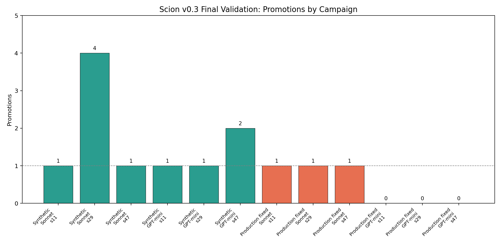
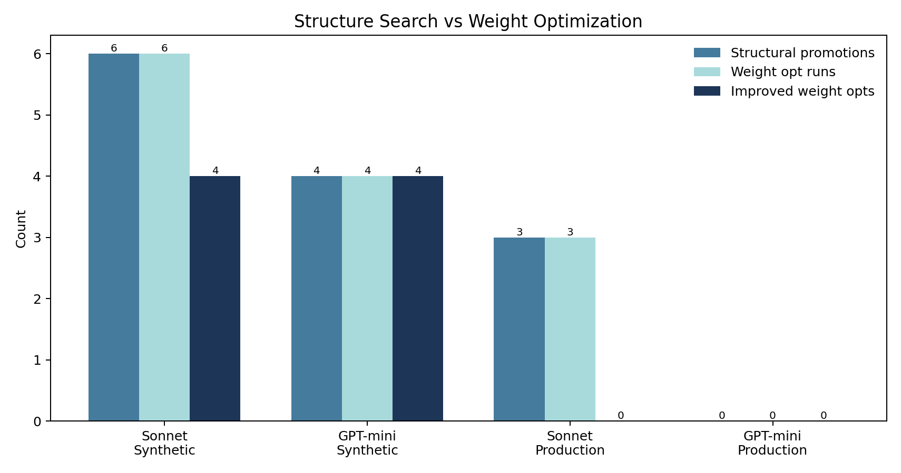
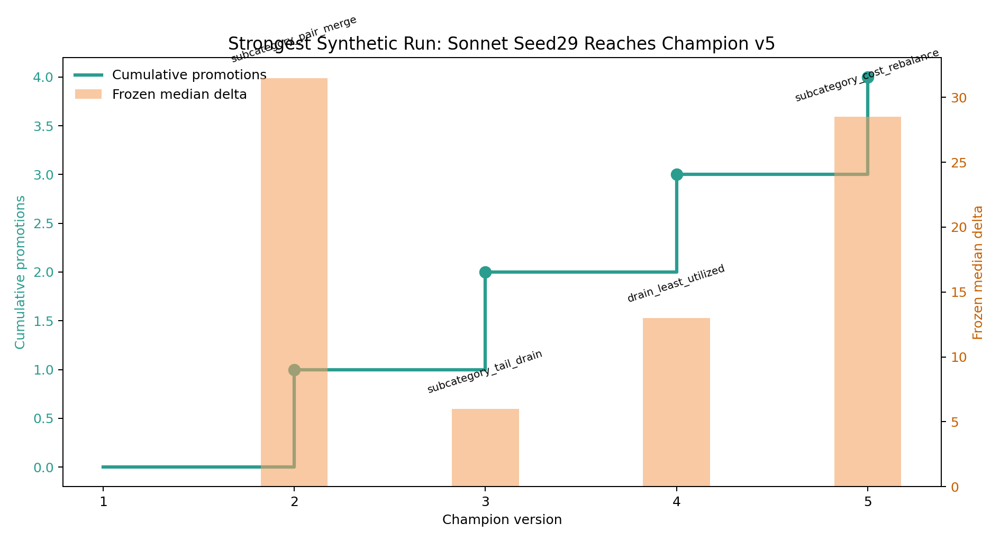
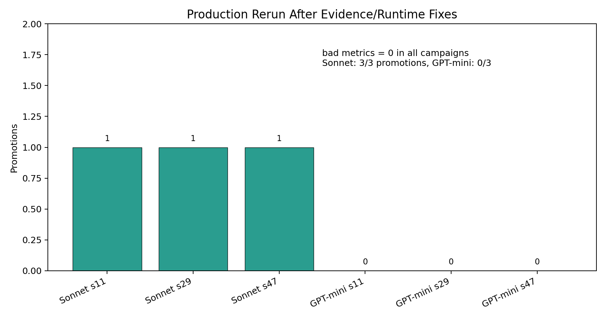
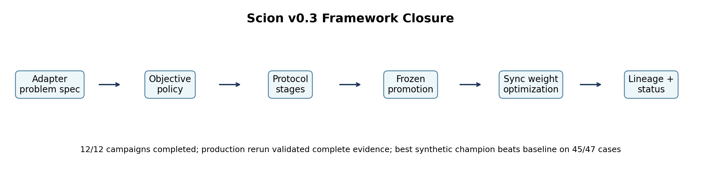

# Scion v0.3 Final Visual Report

*Date: 2026-04-28*

This report is the visual summary of the v0.3 final validation. It combines:

- the formal 12-campaign validation;
- the production timeout/incomplete-evidence rerun;
- the best synthetic champion quality comparison.

Raw experiment directories:

```text
~/research/scion-experiments/v03-final-sync-12campaign-20260426/
~/research/scion-experiments/v03-production-timeout-fix-validation-20260428b/
~/research/scion-experiments/v03-final-best-quality-20260428/
```

The active claim-to-artifact map is maintained in
[evidence-manifest.md](../../evidence/manifest.md). Production conclusions should use
the timeout/evidence rerun, not the old formal-run production quality task.

## 1. Overall Campaign Results



Key result:

- Synthetic: 6/6 campaigns promoted, 10 total structural promotions.
- Production after timeout/evidence fixes: Sonnet 3/3 promoted; GPT-mini 0/3.
- The framework completed all runs without traceback and with auditable status/summary/DB lineage.

## 2. Structure Search vs Weight Optimization



Interpretation:

- Synthetic gains come from both structure search and weight optimization.
- Production gains are structural; production weight optimization completed but did not improve in the rerun.
- GPT-mini can improve synthetic cases, but did not produce reliable production promotions.

## 3. Strongest Optimization: Synthetic Sonnet Seed29



This is the strongest v0.3 campaign:

```text
campaign = sonnet-4-6_synthetic_seed29
final champion = v5_r0
promotions = 4
```

Promoted operators:

```text
v2: subcategory_pair_merge.py
v3: subcategory_tail_drain.py
v4: drain_least_utilized.py
v5: subcategory_cost_rebalance.py
```

This run is the clearest demonstration that Scion can build a sequence of useful heuristic improvements, not just find a one-off operator.

## 4. Best Synthetic Champion Quality


Best synthetic champion:

```text
workspace = sonnet-4-6_synthetic_seed29/champions/champion_v5
cases = 47 CPLEX-comparable synthetic cases
```

Against v1 baseline:

```text
better = 45
equal  = 2
worse  = 0
sum Δf1 vs baseline = -2899
median Δf1 vs baseline = -17
```

Against CPLEX final reference:

```text
better = 28
equal  = 3
worse  = 16
sum f1 gap vs CPLEX = -2710
median f1 gap vs CPLEX = -9
```

CPLEX caveat: CPLEX final is a report-only reference. Some rows are feasible/time-limit references, not exact optimality certificates. Comparisons must keep solver status in view.

## 5. Production Rerun After Evidence/Runtime Fixes



Production rerun after fixes:

```text
bad metrics = 0 across all six campaigns
Sonnet = 3/3 promotions
GPT-mini = 0/3 promotions
```

Sonnet promotions:

```text
seed11: cross_subcat_merge.py      frozen wr=1.0 md=30000
seed29: upgrade_and_absorb.py      frozen wr=1.0 md=38800
seed47: absorb_to_eliminate.py     frozen wr=1.0 md=29600
```

This supersedes the production portion of the first formal 12-campaign run. The earlier production evidence had an incomplete-evidence flaw; the rerun confirms production optimization is possible under complete evidence with Sonnet.

## 6. Framework Closure



v0.3 closure claim:

```text
Scion is now a generic, auditable agentic algorithm optimization framework
for the warehouse-delivery VNS research object.
```

What v0.3 proves:

- The framework can autonomously improve a combinatorial-optimization heuristic on synthetic frozen-gate validation.
- The framework can produce complete-evidence production improvements with a strong model.
- The lifecycle is auditable end to end:
  - protocol selection
  - objective policy
  - hypothesis and code traces
  - verification
  - screening/validation/frozen gates
  - promotion
  - sync weight optimization
  - lineage and summaries

What remains for v0.4/v1:

- Performance-aware optimization as a first-class framework goal.
- Runtime feedback in LLM context.
- Production-quality operator complexity contracts.
- CVRP as the v0.4 second problem class for generalization.
