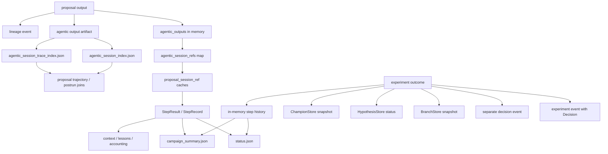
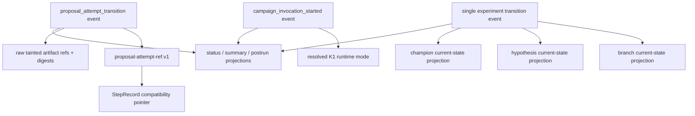

# Scion v0.4 R6 Durable-State Authority and Deletion Plan

> **SUPERSEDED — historical engineering record only.**
>
> V3 and the active `scion/TASK.md` retire every identity, owner-token,
> capability, lease, issuance/registration, receipt/hash-authority,
> activation/reopen and repeated closure mechanism described below. Its old
> `active`, `accepted`, `frozen`, `authorized` or `pending` wording has no
> current force and authorizes no implementation, test, build, launch or
> experiment. Preserve any domain or scientific observation as history; do not
> restore its proof lifecycle.


*Date: 2026-07-12*
*Status: design and source audit only; no production or test change*
*Authority: `design/scion-architecture-v3.md`, current v0.4 source, K1 runtime-mode and K2 attempt-artifact designs*

## Decision

R6 will make the existing SQLite lineage boundary the append-only authority for
scientific transitions and invocation identity, while keeping branch,
hypothesis, and champion tables as explicit mutable current-state projections.
`status.json`, `campaign_summary.json`, prepared-launch artifacts, postrun
inventories, agentic indexes, and `StepRecord` remain projections or pointers;
none may become a Decision input or resume-state authority.

R6 is a deletion-driven migration. It introduces only the missing durable
identity and proposal-attempt transition records, migrates readers to those
records, then removes duplicate writers, aliases, and fallback chains. It adds
no budget, truncation, top-N selection, context omission, retry limit, or new
research gate.

## V3 Invariants

1. Deterministic code owns Contract, Verification, Protocol, Decision,
   persistence, and state transitions. Free text and model artifacts are
   tainted evidence, never Decision inputs.
2. An accepted scientific transition is represented once in append-only
   lineage. Mutable tables may cache current state, but their update must be
   attributable to that transition and testably rebuildable.
3. One fact has one authoritative writer. Other surfaces carry a source event
   id, digest, or compact ref rather than independently reconstructing it.
4. Raw prompts, responses, patches, and transcripts remain in their owning
   artifacts. Lineage stores their public refs and stable digests, not another
   full copy.
5. Runtime state must resume without `status.json`, `campaign_summary.json`, or
   postrun artifacts. Corrupting those files must not affect resumed behavior.
6. `status.json` is an operational snapshot and `campaign_summary.json` is a
   report projection. Neither is a decision source, durable counter, or resume
   checkpoint.
7. Prepared-launch artifacts record launch intent. A committed invocation-start
   event records the mode actually resolved by runtime. Postrun may compare the
   two; it may not infer runtime mode from session artifacts.

## Current Multiple Representations



Target:



The second graph is directional: projections read committed facts. They do not
write facts back into runtime state.

## Source Audit Findings

### P0 — Campaign identity and resume continuity are conflated

`core/campaign_composition.py` creates a new UUID on every construction and
resets `_step_history` and `_round_num`. Its restore path reloads active branches
and selected hypothesis/patch state, but not campaign identity, completed step
history, proposal counters, or round counters. `launcher/resume.py` deliberately
copies the database/workspaces/champion state while quarantining terminal JSON.
Consequently a copied database can contain events from an older id while the
new process writes a new id, and in-memory counters begin again.

`LineageRegistry.get_campaign_summary()` currently aggregates experiment rows
without campaign filtering. The combination makes cross-invocation totals and
resume semantics ambiguous.

R6 separates:

- `campaign_id`: stable scientific campaign identity, preserved across resume;
- `invocation_id`: fresh identity for each CLI process/run invocation;
- `attempt_id`: fresh identity for one proposal attempt;
- `event_id`: fresh identity for one committed transition.

### P0 — Decision is written twice

`core/evidence_recording/lineage.py::record_step_lineage` appends an experiment
row already containing Decision and `decision_features_json`, then calls
`LineageRegistry.record_decision` to append a second row. The decision row does
not include `campaign_id`, `invocation_id`, hypothesis id, or a parent event id.
The integrity accumulator even treats both writes as necessary for one step.

R6 records one terminal experiment transition containing deterministic Decision
features and outcome. If a separate decision event is retained for query shape,
it must be a pure projection rebuilt from the terminal transition, never a
second independently committed fact. The preferred end state deletes the
second writer and its integrity requirement.

### P1 — Mutable current state and append-only audit have no declared boundary

`LineageRegistry.record_event` is INSERT-only. `BranchStore.save` and
`HypothesisStore.save` use `INSERT OR REPLACE`; hypothesis lifecycle updates and
champion promotion mutate current-state tables. These are useful runtime
projections, but current events do not necessarily describe every mutation well
enough to rebuild them.

R6 retains the tables, declares them current-state projections, and requires
each mutation to reference a committed transition. Replay tests, not comments,
must prove that their minimum schedulable state can be rebuilt.

### P1 — Proposal/session identity fans out through mode-specific caches

Agentic proposal truth is spread across full output artifacts, session and trace
indexes, lineage, `agentic_outputs`, `agentic_session_refs`, explore-pipeline
caches, `StepResult`, `StepRecord`, status, summary, accounting, context, lesson,
and postrun readers. Direct mode has no equivalent durable attempt owner.

K2's `proposal_attempt_transition` becomes the mode-neutral join. Agentic
session/trace indexes remain ablation diagnostics; direct traces remain raw call
evidence. `proposal_session_ref` is temporarily an adapter projection derived
from `proposal-attempt-ref.v1`, never an independent write.

### P1 — Status and summary duplicate loop facts and compatibility aliases

`EvidenceRecorder.write_status` starts from `CampaignManager.get_state`, then
adds campaign-loop, last-result, progress, validity, and top-level aliases.
`CampaignSummaryMixin.write_campaign_summary` separately reconstructs many of
the same fields from step history, state, loop status, protocol, and telemetry.
`evidence_recording/status.py` mirrors many nested `campaign_loop` values at the
top level. `run_validity.py`, accounting, and screening lineage contain more
legacy alias/fallback behavior.

R6 makes both JSON documents schema-versioned projections from an explicit
read model. During migration their compatibility fields may remain, but no new
runtime reader may consume them. R6.3 removes the aliases after postrun and
tests migrate.

### P2 — Prepared, run, and postrun status repeat intent and observed facts

Launchers emit `launch.env`, prepared manifests, root `run_status.json`, run
commands, and campaign-local status/summary. Postrun inventory code performs
multi-document first-available fallbacks. Resume snapshots preserve old terminal
documents for reporting while correctly removing them from the new campaign
directory.

The durable contract is:

```text
prepared manifest  = intended configuration
invocation event   = runtime-resolved configuration and identity
terminal event     = committed completion/stop semantics
status/summary     = replaceable projections
postrun inventory  = report joining explicit sources, never first-value truth
```

## Fact Authority and Migration Matrix

| Fact | Target authoritative writer | Current duplicate writers / fallback readers | Deletion order | Required acceptance |
| --- | --- | --- | --- | --- |
| Scientific campaign identity | campaign creation/resume service; one immutable lineage campaign record | constructor UUID, copied DB event ids, prepared/resume manifests, status and summary | write/read durable id; scope queries; remove constructor-only authority | resume keeps `campaign_id`; new `invocation_id`; no mixed campaign aggregate |
| Invocation identity and K1 runtime mode | `campaign_invocation_started` append before proposal work | prepared manifest/env, pipeline bool, status, summary, session-ref inference, postrun fallbacks | commit resolved mode; project it; delete session inference and legacy persisted bool fallback | prepared intent equals observed mode or postrun reports mismatch; mode never inferred from session |
| Branch lifecycle/current workspace | terminal/recovery transition event, projected by `BranchStore` | branch table, controller memory, branch cards, step history, status/summary | add transition refs; replay/shadow compare; remove report-derived reconstruction | DB replay restores identical schedulable branches without terminal JSON |
| Hypothesis identity and lifecycle | `HypothesisStore` projection applied from committed hypothesis/attempt transitions | proposal object, StepRecord, branch maps, artifact hydration, lineage text | commit K2 transition; reference hypothesis row; eliminate independent lifecycle writes | one hypothesis id/status owner; artifact cannot mutate lifecycle |
| Proposal attempt phase/status/failure lane | K2 append-only `proposal_attempt_transition` | agentic output/session/trace indexes, in-memory maps/caches, session ref, status/summary | dual-publish canonical ref; migrate consumers; delete mode-specific common-state caches | direct and agentic produce identical compact schema and transition cardinality |
| Prompt/response/patch evidence | owning trace/output/formal-candidate artifact; lineage ref/digest | copied summaries, session index fragments, trajectory heuristic joins | add stable refs/digests; join by ids; remove copied fragments and heuristic fallback | every ref resolves and digest matches; no full tainted payload in Decision/state tables |
| Experiment Contract/Verification/Protocol/Decision | one terminal experiment transition event | experiment row plus decision row, StepRecord, status/summary, protocol counters | define one schema; migrate queries; stop/delete decision duplicate writer | one event per terminal transition; exact DecisionFeatures replay; no free text input |
| Champion promotion/version | promotion transition, projected by `ChampionStore` | champion table, manager memory, branch state, summary, checkpoint refs | event before projection; rebuild; delete summary fallback | promotion is idempotent and replay restores the same version/hash |
| Proposal/experiment counters and stop semantics | event-derived campaign read model plus explicit terminal event | `_round_num`, `_step_history`, campaign loop, status aliases, summary/accounting fallbacks | derive/shadow compare; persist terminal event; delete alias reads | crash/resume cannot reset or double-count; status deletion has no behavioral effect |
| Prepared/resume provenance | prepared manifest for intent; invocation event for observed fact; resume manifest for copy provenance | root/campaign run status, snapshot fallback, first-available postrun inventory | name each source; validate joins; remove ambiguous first-value fallbacks | each report field exposes source kind/ref; no report source drives runtime |

## R6.1 — Identity, Mode, and Attempt Journal

Scope:

1. Add schema/migration characterization tests before changing writers.
2. Persist stable `campaign_id`; create a new `invocation_id` for each process,
   including resume.
3. Append `campaign_invocation_started.v1` before proposal work, containing
   campaign/invocation ids, resolved K1 mode, problem/protocol identities,
   prepared-manifest ref/digest when present, and code/config hashes.
4. Keep normalized `ProposalPipeline.use_agentic_proposal` as the in-process K1
   owner during v0.4. The event records its resolved value; it does not create a
   competing mutable mode setting.
5. Implement K2's append-only hypothesis/code attempt transitions and publish
   `proposal-attempt-ref.v1` before status or observer publication.
6. Carry the common ref through the existing `proposal_session_ref` seam only
   as a compatibility adapter. New readers use generic attempt fields.
7. Scope all lineage queries by campaign and, where operationally relevant,
   invocation. Add parent/causation ids for transition joins.

R6.1 does not switch launcher defaults, alter Contract/Verification/Protocol/
Decision, change failure routing policy, or add a limit/gate.

Acceptance:

- fresh and resumed campaigns establish identity before their first proposal;
- resume preserves campaign id and creates a distinct invocation id;
- `direct_v3` and `agentic_ablation` attempts have the same compact refs and
  terminal-phase cardinality;
- removing all status/summary files before resume does not change identity or
  mode resolution;
- a lineage write failure is classified as infrastructure failure before a
  proposal is exposed to outer gates or status observers;
- no K1 mode value is inferred from presence of an agentic session or artifact.

## R6.2 — Replayable Current State and Single Scientific Transition

Scope:

1. Define versioned transition schemas for branch lifecycle, hypothesis status,
   experiment completion, champion promotion, recovery, and terminal stop.
2. Commit a transition first, then update mutable branch/hypothesis/champion
   projections with `last_event_id` and schema version.
3. Replace experiment-plus-decision dual writes with one atomic terminal
   experiment transition. Migrate decision queries to that row.
4. Build a deterministic campaign read model for counters, completed steps,
   stop semantics, and current schedulable state. Derive when cheap; checkpoint
   only as a rebuildable projection with a source event watermark.
5. On resume, validate projection watermark/digests. Rebuild from lineage when
   absent or inconsistent; never consult status/summary.
6. Make lineage integrity a database-backed query scoped to campaign/invocation,
   rather than an invocation-local Python accumulator compared with reset step
   history.

Acceptance:

- replay into empty projection tables reproduces branch, hypothesis, champion,
  counters, and stop state;
- crash tests at every commit/projection boundary either replay cleanly or
  idempotently finish the projection;
- duplicate event ids and duplicate terminal transitions are rejected;
- the same resume never double-counts a proposal or research iteration;
- Decision is reproduced solely from typed `DecisionFeatures` and deterministic
  results; summaries, prompts, rationales, and session artifacts are absent;
- campaign summaries and query counts cannot include another campaign.

## R6.3 — Projection and Compatibility Deletion

Scope:

1. Generate status and summary from the explicit read model and committed event
   refs. Keep only operational/report fields with named provenance.
2. Migrate accounting, context, lesson, material-difference, run-validity,
   postrun, and prepared-prompt readers to canonical attempt/transition fields.
3. Shadow-compare canonical reads with compatibility fallbacks on legacy
   fixtures. Classify a mismatch instead of silently selecting the first value.
4. Stop duplicate writers, then delete aliases, caches, fallback chains, and
   redundant columns/functions listed below.
5. Retain explicit legacy migration at the artifact-ingest boundary only. New
   campaigns must never write a legacy shape.

Acceptance:

- runtime tests pass with status and summary writes disabled;
- corrupt status/summary values are ignored by resume and Decision;
- every current schema field has exactly one writer and documented projection
  consumers;
- legacy fixtures remain report-readable through one isolated adapter;
- production Python line count after R6.3 is net negative against the R6
  baseline, excluding migrations and tests;
- no new generic helper file exists solely to preserve two representations.

## Net Deletion Ledger

| Candidate to delete or collapse | Removal gate | Expected net result |
| --- | --- | --- |
| Separate `record_decision` write and `decision_recorded` integrity branch | all decision queries consume terminal experiment transition | one scientific outcome, one durable write path |
| Top-level mirroring in `_merge_campaign_loop_observability` | status/postrun readers consume versioned nested read model | remove broad alias map and paired tests |
| `apply_run_completion_aliases` and summary completion aliases | terminal stop event and report schema are authoritative | remove repeated completion reconstruction |
| `legacy_stage_count_fallbacks` and accounting first-value chains | counters derive from scoped events/read model | remove silent source precedence |
| `_with_screening_case_level_gate_aliases` and legacy screening columns | lineage query/report migration complete | one name per screening fact |
| `agentic_session_refs` map and pop path for common attempt state | both modes publish `proposal-attempt-ref.v1` | agentic store keeps diagnostics only |
| Explore `_proposal_session_ref_cache` and repeated propagation helpers | StepResult/StepRecord receive committed attempt ref directly | remove cache coherence path |
| Legacy `proposal_session_ref` field and summary/status filters | every consumer reads `proposal_attempt_ref`; legacy ingest adapter isolated | delete agentic-named common seam |
| Copied session-ref fragments in context/lesson/material-difference readers | readers join canonical ref by attempt/event id | fewer defensive shapes and key probes |
| Proposal trajectory heuristic joins across agentic session, trace, and formal candidate indexes | all artifacts carry attempt/event ids | deterministic join; delete branch/time inference |
| Postrun lifecycle multi-document `first available` fallbacks | report inventory names prepared, observed, and projected sources separately | mismatches become evidence, not hidden precedence |
| Persisted legacy `agentic_proposal` fallback in new artifacts | all current launch/runtime schemas require explicit `proposal_runtime_mode` | one K1 persisted vocabulary; legacy only at ingest |
| Summary reconstruction from `_step_history` where event read model exists | R6.2 replay parity passes | summary becomes a replaceable projection |

Every ledger row must finish as `deleted`, `retained with named invariant`, or
`blocked by named legacy fixture and owner`. “Temporary dual write” is not a
valid final state.

## Migration Order

```text
characterize existing writers/readers and legacy fixtures
  -> add canonical schema and append-only writer
  -> dual-publish only for a bounded migration window
  -> switch runtime and report readers to canonical facts
  -> shadow-compare canonical vs legacy projections
  -> stop duplicate writes
  -> delete fallback readers, aliases, columns, and cache paths
  -> replay/crash/resume acceptance
```

Rollback during R6.1/R6.2 means disabling the new reader while retaining the
new append-only rows; it does not mean re-enabling two authoritative writers.
Schema additions must be forward-readable and ignored safely by the old report
path until the reader cutover.

## Acceptance Matrix

| Scenario | Required proof |
| --- | --- |
| Fresh direct run | one campaign/invocation start; explicit `direct_v3`; one attempt id across hypothesis/code; no agentic inference |
| Fresh agentic ablation | same common identity/ref schema; agentic diagnostic artifacts referenced, not copied |
| Resume | same campaign id, new invocation id, counters and active state continue exactly |
| Missing terminal JSON | resume and Decision are unchanged; reports can regenerate |
| Corrupt terminal JSON | mismatch is reported postrun; runtime ignores it |
| Crash after transition before projection | restart replays the projection once |
| Crash after projection | watermark makes replay idempotent |
| Decision audit | one terminal scientific event; typed features reproduce outcome; tainted text absent |
| Artifact audit | public ref is path-confined; referenced bytes exist; digest matches |
| Legacy fixture | one isolated adapter reads it; no new artifact writes legacy keys |
| Cross-campaign database | every count/query is correctly scoped; no event leakage |
| Deletion audit | ledger closed and production Python net negative after R6.3 |
| Control-noise audit | no budget, truncation, context omission, selection policy, or gate change |

## Files That Establish the Current Evidence

- `scion/core/campaign_composition.py`
- `scion/core/campaign_manager.py` and campaign state/summary mixins
- `scion/core/evidence_recording/status.py`
- `scion/core/evidence_recording/accounting.py`
- `scion/core/evidence_recording/lineage.py`
- `scion/core/run_validity.py`
- `scion/core/models.py`
- `scion/core/proposal_pipeline/facade.py`
- `scion/core/proposal_pipeline/agentic_refs.py`
- `scion/proposal/agentic_artifacts.py`
- `scion/proposal/session_trace_index.py`
- `scion/core/proposal_trajectory_artifacts.py`
- `scion/lineage/registry.py`
- `scion/lineage/branch_store.py`
- `scion/launcher/resume.py`
- `scion/postrun/handoff/resume_snapshot.py`
- `docs/planning/v0.4/v0.4-narrow-proposal-k2-artifact-owner-design-20260712.md`

## Out of Scope

- changing prepared launcher defaults or removing agentic ablation mode;
- changing model prompts, visible context, research strategy, retry policy, or
  proposal quality hooks;
- changing Contract, Verification, Protocol, Decision thresholds or gates;
- adding budgets, truncation, omission, or hard limits;
- treating status/summary/postrun output as a new control plane;
- redesigning problem-owned CVRP or warehouse algorithm semantics.
